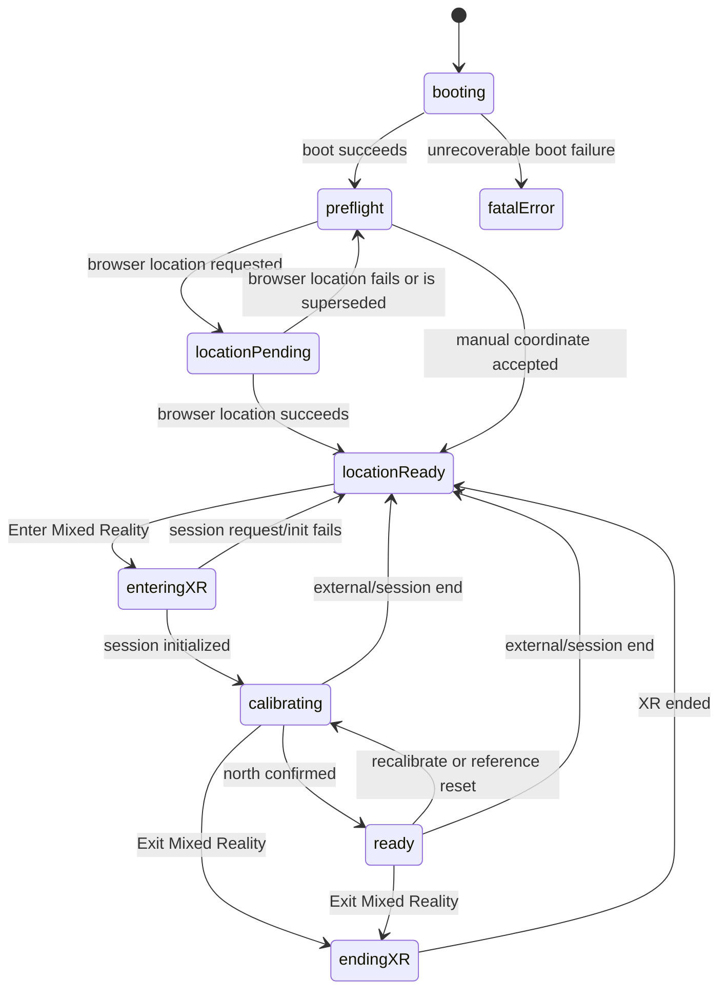
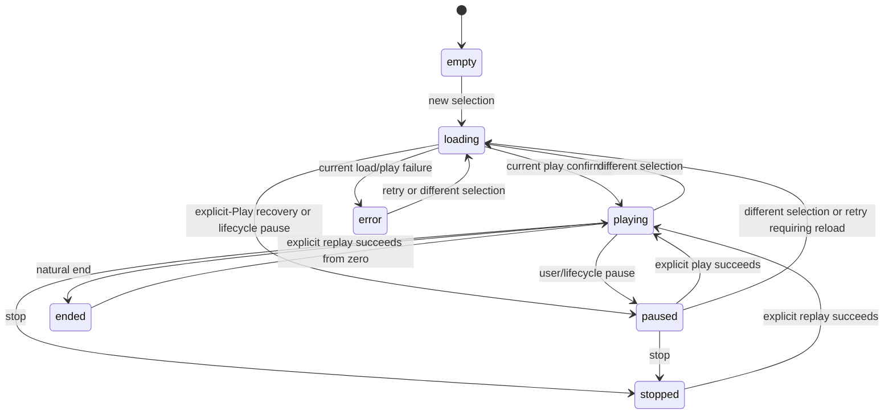
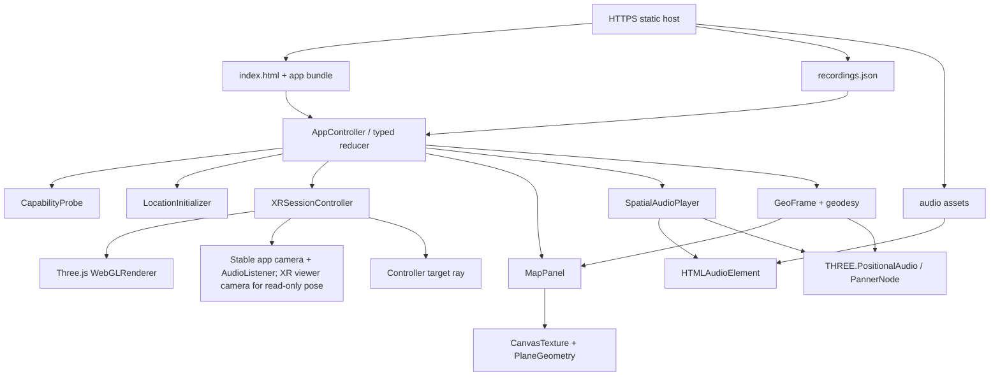
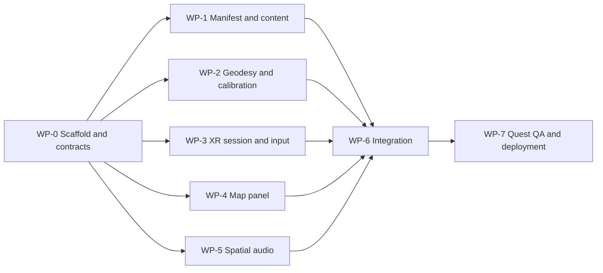

# Product Requirements Document
## Geo-Referenced Spatial Audio Map for Meta Quest 3

**Working title:** attune  
**Status:** Implementation-ready for WP-0 through WP-6 after the Version 1.6 contract freeze; release-gated by declared external inputs  
**Version:** 1.6  
**Date:** 14 July 2026  
**Primary target:** Meta Quest 3, Meta Quest Browser, WebXR `immersive-ar`  
**Audience:** Codex implementation agents, technical lead, product owner, QA

---

## 0. Readiness declaration and normative interpretation

This revision is intended to let an implementation agent proceed without inventing architecture, lifecycle, build, or concurrency policy.

### 0.1 Readiness verdict

- **WP-0 through WP-6 are implementation-ready after the Version 1.6 corrections are committed as the shared contract baseline**, using the example manifest and deterministic fixtures defined in this document.
- **Final content integration is externally gated** by a representative source-metadata sample and an audit of the real audio files' codecs, channel layouts, and point-source suitability.
- **Production release is externally gated** by a selected HTTPS hosting target and recorded testing on a physical Meta Quest 3.
- Missing external inputs MUST NOT cause an agent to guess. The agent MUST implement the documented fixture path, leave the corresponding gate open, and report it.

### 0.2 Normative precedence

The words MUST, MUST NOT, SHOULD, SHOULD NOT, and MAY are normative. Where an appendix introduced in Version 1.6 is more specific than an earlier section, the Version 1.6 appendix controls. A coding agent MUST NOT silently substitute a different framework, dependency, state model, data interpretation, or lifecycle policy.

### 0.3 Meaning of idempotent implementation

For this project, “idempotent” means all of the following:

1. Running setup and verification repeatedly from the same clean commit produces the same dependency graph and equivalent static output.
2. Re-running an assigned work package updates existing files rather than duplicating scaffolds, listeners, DOM roots, canvases, controllers, media elements, or audio nodes.
3. Public app initialization, XR `start()`/`end()`, selection/playback commands, and synchronous/asynchronous `dispose()` operations have explicit duplicate-call behavior.
4. Stale asynchronous results cannot overwrite newer state.
5. Generated content is stable: deterministic ordering, two-space JSON indentation, LF line endings, a final newline, and no generated timestamps.
6. A second agent can verify the first agent's work using the exact commands and acceptance evidence defined here.
7. Idempotence means equivalent repository state, runtime behavior, and resource counts; it does not require unrelated agents to produce byte-identical source code.

### 0.4 External release gates

| Gate | Required input/evidence | Blocks |
|---|---|---|
| G-01 Content adapter | Representative source metadata and field mapping | Final `adapt-metadata.ts`, production manifest |
| G-02 Audio suitability | Codec, container, sample rate, channel count, and spatial-format audit | Production audio acceptance |
| G-03 Heading procedure | Installation-specific way to identify true north, such as a marked direction or trusted compass procedure | On-site calibration sign-off |
| G-04 Hosting | Chosen HTTPS host with configurable response headers and media range requests | Production deployment |
| G-05 Hardware | Physical Quest 3, Browser/OS version, build commit, and test record | Physical-device sign-off for AC-002, AC-005–010, AC-014–015, AC-018, and AC-023 |

---

## 1. Executive summary

attune is a browser-delivered mixed-reality application for selecting and listening to geographically indexed field recordings. The user initializes a geographic position before entering WebXR, enters passthrough mixed reality, calibrates the XR world to true north once, and selects a recording from a north-up map-like panel. The selected recording is rendered as a world-locked spatial-audio point source at the recording's true initial bearing from the user's initialized location.

The MVP deliberately separates **geographic truth** from **auditory presentation**:

- The displayed latitude, longitude, geographic distance, and bearing are calculated accurately from the recording metadata and initialized user coordinates.
- The selected source's **azimuth** is geographically accurate.
- Its virtual radius is fixed at a comfortable, configurable distance—3.0 m by default—rather than attempting to place a source hundreds or thousands of real-world meters away.
- The geographic coordinate and north calibration are fixed for the session.
- The WebXR listener still follows the headset pose every frame, as required for correct binaural rendering when the user turns their head.

The smallest appropriate production architecture is a **static-first WebXR application**:

- Vite
- TypeScript
- Three.js
- Browser-native Geolocation and Web Audio APIs
- One static JSON recording manifest
- Same-origin audio files or CORS-enabled audio URLs
- Static HTTPS hosting
- No runtime server, database, account system, map SDK, UI framework, room scanning, or persistent anchor requirement

The largest implementation risk is not rendering or audio. It is the availability and accuracy of browser geolocation on the target Quest 3 deployment. Meta's reviewed WebXR documentation does not guarantee a Quest-specific geolocation or compass source. Therefore, browser geolocation is a progressive enhancement and **manual latitude/longitude entry is a mandatory MVP fallback**.

---

## 2. Source-backed platform decisions

The following constraints are architectural, not optional preferences.

1. **WebXR is appropriate for this scope.** Meta characterizes WebXR as a good fit for lightweight experiences, prototypes, and experiences that benefit from web distribution. It runs in Browser without native SDK installation and supports mixed reality, while deeper platform services remain more limited than native development. [R1]

2. **Use passthrough mixed reality.** The session mode is `immersive-ar`. Meta documents feature detection through `navigator.xr.isSessionSupported('immersive-ar')` and requires a transparent render background for passthrough to remain visible. [R3]

3. **Serve through HTTPS.** WebXR and Geolocation are secure-context features. The supplied Quest 3 field report likewise identifies HTTPS as a practical requirement for local-device testing. [R7] [R8] [R12]

4. **Request geolocation before entering immersive XR.** The WebXR specification requires an immersive session to be shut down before a non-XR permission prompt is displayed. Location permission must therefore be resolved in the two-dimensional preflight screen, before `requestSession()`. [R5]

5. **Enter XR from a user gesture.** An immersive session request requires transient user activation, such as pressing an “Enter Mixed Reality” button. [R5]

6. **Start or resume audio from a user gesture.** Browser autoplay policy requires an `AudioContext` to be created or resumed from a user action. The Enter MR button should resume audio before requesting the XR session; the first XR selection event provides a second recovery opportunity if needed. [R8]

7. **Do not assume WebXR's axes are aligned to true north.** `local` and `local-floor` reference spaces use platform-defined X/Z position and orientation. The application must establish a geographic frame through an explicit calibration step. [R5]

8. **Keep the listener live.** Three.js represents the audio listener as a child of the camera, so the camera's transform is the listener transform. The app freezes the geographic frame, not the headset pose. [R9] [R10]

9. **Use a controller target ray for compact, reliable interaction.** Three.js exposes controller target-ray spaces specifically for pointing interactions. [R11]

10. **Keep rendering minimal.** Meta warns against unnecessary overdraw, complex transparent layers, many lights, and real-time shadows. This product needs only one canvas-textured panel, a pointer ray, and optional simple debug geometry. [R4]

11. **Use direct Three.js rather than Meta Immersive Web SDK for this MVP.** Meta's current Immersive Web SDK provides broad systems for ECS, locomotion, physics, hands, spatial UI, and scene understanding. Those systems exceed this product's needs. Direct Three.js preserves the smallest dependency and runtime surface while remaining aligned with Meta's documented WebXR workflow. Introducing IWSDK requires a new architecture decision. [R2] [R13]

12. **Reset the reusable media element through the HTML media-element load algorithm.** Calling `load()` stops the prior resource, settles/removes pending media tasks and play promises, clears prior media error state, and starts a fresh resource-selection cycle. Source replacement therefore uses an explicit reset load followed by one target-assignment load, while operation generations and captured play promises guard application state. [R14]

---

## 3. Product vision

### 3.1 Problem statement

A field recording has a geographic origin, but conventional audio players strip that origin from the listening experience. attune should restore a perceptual relationship between the listener's initialized position and each recording's place of capture without requiring a native Quest application or a complex geospatial backend.

### 3.2 Product proposition

> Choose a place on a spatial map, then hear its recording from the geographic direction in which that place lies.

### 3.3 Primary user

A visitor, researcher, artist, or curator wearing a Meta Quest 3 who wants to browse a collection of geographically indexed field recordings and perceive their directional relationship to the current listening location.

### 3.4 Core user value

- Geographic metadata becomes immediately perceptible.
- Selection remains explicit and legible through a map-like interface.
- The experience is distributable by URL and does not require an app-store build.
- The initial implementation remains small enough to audit, adapt, and deploy for installations or research studies.

---

## 4. MVP goals, success conditions, and non-goals

### 4.1 MVP goals

The MVP MUST:

1. Run in Meta Quest Browser on Meta Quest 3 through an HTTPS URL.
2. Support `immersive-ar` passthrough.
3. Initialize the user's latitude and longitude once before XR entry.
4. Permit manual coordinate entry when browser geolocation is denied, unavailable, inaccurate, or unsupported.
5. Calibrate a true-north direction once inside the XR session.
6. Present every valid recording location in a north-up, map-like spatial panel.
7. Allow a Touch controller ray and trigger/select action to choose a recording.
8. Calculate geographic distance and initial bearing from the initialized user coordinate to the selected recording.
9. Place one selected recording as an HRTF spatial-audio source at the calculated bearing.
10. Keep the audio source world-locked while the listener follows live headset movement.
11. Show selection, loading, playing, paused, and error states.
12. Pause and clean up audio when the XR session ends.
13. Be deployable as static files without a runtime backend.

### 4.2 Technical success conditions

The release is successful when:

- Synthetic north, east, south, and west recordings map to front, right, back, and left after north calibration.
- Turning the head changes the binaural rendering of the world-locked source rather than rotating the source with the head.
- Only one recording is active at a time.
- A denied geolocation prompt does not prevent the user from entering valid manual coordinates and using the experience.
- No location permission prompt is triggered after immersive XR has begun.
- The application runs for a five-minute Quest 3 test without sustained frame degradation, audio graph duplication, or unbounded memory growth.
- The production bundle contains no general UI framework, map SDK, database client, or server runtime.

### 4.3 Explicit non-goals for MVP

The MVP MUST NOT expand into:

- Continuous GPS tracking
- Automatic true-north detection
- Navigation or turn-by-turn routing
- Dynamic commercial map tiles
- Room scanning, plane detection, scene understanding, or occlusion
- Persistent spatial anchors
- Multiple simultaneous recording sources
- Hand-tracking interaction
- Accounts, authentication, analytics, or a content-management system
- Location storage or location upload
- Offline/PWA packaging
- Multiplayer or shared alignment
- Altitude-aware placement
- First-order ambisonic rendering
- Double-rendering of already binaural material
- Native Quest packaging

These are candidate later phases, not latent MVP requirements.

---

## 5. Resolved product decisions

| Concern | MVP decision | Reason |
|---|---|---|
| XR mode | `immersive-ar` | Passthrough keeps the user oriented in the physical environment. |
| Runtime architecture | Static client application | The supplied collection already exists; no CRUD or server-side logic is required. |
| Core stack | Vite + TypeScript + Three.js | Small, typed, and sufficiently close to WebXR/Web Audio primitives. |
| UI representation | North-up radial geographic map | Avoids tile services and API keys while preserving bearing and relative distance. |
| Location | One-shot browser geolocation with mandatory manual fallback | Quest-specific availability and accuracy are not guaranteed. |
| Heading | User faces true north and confirms once | WebXR reference-space orientation is not geodetic. |
| Geographic frame | Fixed for the XR session | Matches the requested initial implementation. |
| Head tracking | Live every XR frame | Required for perceptually correct spatial audio. |
| Number of sources | One active recording | Clear interaction, low CPU use, and no masking between sources. |
| Spatial radius | Constant 3.0 m by default | Preserves audibility and directional clarity independently of continental-scale distances. |
| Geographic distance | Displayed numerically and on map scale | Maintains factual distance without impossible XR world coordinates. |
| Input | Touch controller target ray + select | Reliable and compact; no hand-tracking scope. |
| Audio transport | One reusable `HTMLAudioElement` routed through one `THREE.PositionalAudio` | Streams long files and avoids decoding the full collection into memory. |
| Map implementation | One `CanvasTexture` on one plane | Minimal draw calls and no DOM-overlay dependency. |
| Audio asset origin | Same origin preferred | Avoids CORS and credential complexity. |

---

## 6. User experience

### 6.1 End-to-end flow

1. **Open URL.** The user opens the production HTTPS URL in Meta Quest Browser.
2. **Preflight.** A two-dimensional page checks WebXR support, `immersive-ar` support, secure context, manifest validity, and basic audio compatibility.
3. **Initialize location.** The user selects “Use current location” or enters latitude and longitude manually.
4. **Review initialization.** The page shows the selected coordinate, source (`browser` or `manual`), location accuracy when available, and any accuracy warning.
5. **Enter mixed reality.** The user presses “Enter Mixed Reality.” The click resumes the audio context and calls `requestSession('immersive-ar')`.
6. **Calibrate north.** Inside XR, the user sees: “Face true north, look approximately level, then press the trigger.” The app captures the horizontal camera-forward vector and initial listener position.
7. **Browse map.** A north-up panel appears in front of the calibration position. Markers show recording directions and normalized distances.
8. **Select recording.** The user points at a marker and presses the trigger.
9. **Listen.** The panel shows metadata, distance, bearing, playback state, and progress. The source plays from the corresponding world direction.
10. **Turn and inspect.** The source remains fixed in the calibrated world; the listener changes with the user's head pose.
11. **Change selection.** Selecting a different marker performs a sequential fade-out, source replacement, and fade-in. Because the MVP owns one media element, this is not an overlapping crossfade. If the browser rejects the post-fade play attempt, the new selection remains visible and an explicit Play action completes recovery.
12. **Recenter or recalibrate.** The user can recenter the panel or repeat north calibration.
13. **Exit.** Ending the XR session pauses playback and returns to the preflight page without retaining the location beyond page memory.

### 6.2 State model

Application phase and playback are orthogonal state machines. Implementations MUST NOT create combined phases such as `LoadingAudio` or `Playing`; those values belong only to `PlaybackState`.





Appendix D defines the exact initial values, action legality, duplicate-call behavior, and side effects. An invalid semantic action is ignored without state mutation unless Appendix D explicitly requires an error.

### 6.3 Fixed versus live values

This distinction is mandatory because the phrase “fixed direction” can otherwise produce an incorrect audio implementation.

**Fixed after calibration:**

- User latitude and longitude
- Location accuracy metadata
- Initial XR listener position used as the geographic origin
- Calibrated true-north unit vector
- Derived east unit vector
- Each selected source's world position until selection or recalibration changes

**Live while XR is running:**

- Headset position and orientation
- Audio listener transform
- Controller target-ray transform
- Playback progress
- XR session visibility and lifecycle state

The source MUST NOT be parented to any camera. The single `AudioListener` MUST be parented once to the stable application-owned `PerspectiveCamera` passed to `renderer.render(scene, appCamera)`. It MUST NOT be reparented to the session-specific `ArrayCamera` returned by `renderer.xr.getCamera()`.

---

## 7. Functional requirements

### FR-001 — Content manifest

The application MUST load a versioned JSON recording manifest before enabling XR entry.

It MUST reject or disable records with:

- Missing or duplicate IDs
- Missing title
- Invalid latitude outside `[-90, 90]`
- Invalid longitude outside `[-180, 180]`
- Missing audio URL
- Unsupported `spatialFormat`
- Non-finite numeric values

At runtime, each invalid record MUST be rejected independently and the remaining content-valid records MUST load. The collection fails only when the manifest envelope is invalid or no content-valid record remains. Codec capability is tracked separately as `eligible`, `probe-at-play`, or `unsupported`; it does not turn a content-valid record into a validation rejection. The preflight page MUST report content-valid, rejected, and conclusively unsupported counts.

### FR-002 — Capability preflight

The two-dimensional shell MUST inspect and record:

- `window.isSecureContext`
- `navigator.xr` existence
- `navigator.xr.isSessionSupported('immersive-ar')` when `navigator.xr` exists
- `navigator.geolocation` existence
- Manifest load and validation result
- At least one manifest record whose supplied MIME type returns `"maybe"` or `"probably"` from `canPlayType()`, or at least one record without a MIME hint that remains eligible for runtime probing

In normal mode, an insecure context, absent WebXR API, or a false/rejected immersive-AR support probe is fatal according to Section 14. In `?debug=1`, those three capability results are retained as nonfatal warnings: the application MUST NOT call `requestSession()`, the Enter Mixed Reality control is hidden or disabled, and the desktop map/audio workflow remains available. When `navigator.xr` is absent, the support result is deterministically `false` and no support method is called.

The preflight MUST NOT fetch every audio file. It MUST block the usable workflow only when the manifest envelope is invalid, no content-valid record remains, renderer/audio initialization fails, or every valid record is conclusively unsupported. Records without a MIME hint remain selectable and are validated by actual media outcomes. The shell MUST present human-readable recovery actions rather than raw exception strings.

### FR-003 — Browser location initialization

“Use current location” MUST call:

```ts
navigator.geolocation.getCurrentPosition(success, failure, {
  enableHighAccuracy: true,
  timeout: 10_000,
  maximumAge: 60_000,
});
```

A browser success is accepted only when latitude/longitude are finite and in range. `accuracyM` is retained only when finite and nonnegative; otherwise it is omitted. Invalid success data maps to `LOCATION_INVALID` and leaves manual entry available.

The app MUST retain:

- Latitude
- Longitude
- Accuracy in meters when valid and supplied
- `timestampMs = position.timestamp` when it is finite and nonnegative; otherwise `Date.now()` captured inside the success callback
- Source type: `browser`

The app MUST NOT depend on `coords.heading`; it represents direction of travel and may be unavailable for a stationary user.

Location acquisition uses a monotonically increasing `locationGeneration`. The first “Use current location” action starts one request and stores its promise; a duplicate action while pending reuses that same internal promise and does not call `getCurrentPosition()` again. The stored pending-promise reference is cleared in `finally` only when its captured generation is still current. A Retry action increments the generation before starting one new request. Manual submission, disposal, or XR entry also increments the generation and clears the stored pending reference without waiting for the browser callback. Success and failure callbacks mutate state only when their captured generation is still current. Therefore, a late browser result MUST NOT overwrite a newer manual coordinate or a later retry.

### FR-004 — Manual location fallback

The preflight UI MUST always expose manual latitude and longitude entry, including when browser geolocation is present.

Manual input MUST:

- Unicode-trim each field and require `/^[+-]?(?:\d+(?:\.\d*)?|\.\d+)$/`; commas, exponent notation, degree symbols, `NaN`, `Infinity`, and trailing characters are invalid
- Convert with `Number`, require finite values, and validate latitude `[-90, 90]` and longitude `[-180, 180]` before enabling XR
- Normalize negative zero to zero with `Object.is(value, -0) ? 0 : value`
- Use WGS 84 latitude/longitude semantics
- Set `timestampMs = Date.now()` and source type `manual`
- Increment `locationGeneration` so a pending browser callback cannot overwrite the manual value
- Avoid placing coordinates in a URL, remote log, or analytics event

### FR-005 — Location accuracy warning

When browser accuracy is present:

- `<= 50 m`: show normal status
- `> 50 m and <= 100 m`: show a moderate warning
- `> 100 m`: show a strong warning and offer manual override

These thresholds are product defaults, not a claim about device hardware.

### FR-006 — XR session creation

XR entry MUST be initiated by a visible button click. The renderer MUST be configured with `renderer.xr.enabled = true` and `renderer.xr.setReferenceSpaceType('local')` before the button can be used.

`XRSessionController.start()` MUST invoke this exact request synchronously before returning its `XRStartOperation`:

```ts
const sessionPromise = navigator.xr.requestSession('immersive-ar', {
  optionalFeatures: ['local-floor'],
});
```

`local-floor` is the only optional feature in the MVP request. Listing it at session creation is required before `session.requestReferenceSpace('local-floor')` can succeed when the user agent treats floor alignment as a permission-gated feature. `local` remains the immersive baseline and is requested as the fallback reference space after session creation.

Within the same synchronous click callback, invoke both gated operations before awaiting either one:

```ts
const audioResumePromise = audioPlayer.resumeContext();
const xrStart = xrSessionController.start(); // calls requestSession synchronously

const [audioOutcome, sessionOutcome] = await Promise.allSettled([
  audioResumePromise,
  xrStart.result,
]);
```

Required handling:

1. If the XR request rejects, map the DOM exception to an application error and do not initialize an XR scene.
2. When the XR operation rejects, ignore the audio outcome for UI state, dispatch only the generation-matched XR failure, and do not initialize an XR scene. When XR succeeds, dispatch `XR_STARTED` for its generation and then dispatch generation-bearing `AUDIO_GESTURE_REQUIRED` with `required = true` only when audio resume rejected or left the context non-running; a successful resume dispatches `required = false`. A later explicit Play or an idle marker selection invokes `resumeContext()` and `media.play()` synchronously before its first `await`; an audible-source switch follows the required fade first and may therefore fall back to explicit Play.
3. Register the session's `end`, `visibilitychange`, `inputsourceschange`, and primary `select` handlers before exposing interaction.
4. Call and await `renderer.xr.setSession(session)` exactly once for that session.
5. Request `local-floor`; if it rejects, request the always-default immersive `local` space. Set the resulting space through `renderer.xr.setReferenceSpace(space)` and register its `reset` handler.
6. If renderer or reference-space initialization fails after session creation, attempt `session.end()`, remove all listeners, and return to `locationReady`.
7. Increment a monotonically increasing `sessionGeneration` before each start. The handle, every registered listener closure, every emitted XR runtime event, and every partial-initialization continuation captures that generation. They mutate state only when it remains current. Cleanup increments the generation before removing listeners. A late session or event from an older generation is ended/ignored and cannot affect a re-entered session.
8. Store one session handle and reject a second concurrent start with `XR_SESSION_ALREADY_ACTIVE`.

No geolocation call is permitted after session creation. Session initialization MUST follow the detailed ownership and teardown rules in Appendix D.

### FR-007 — Passthrough rendering

The renderer MUST use an alpha-capable WebGL context and a transparent clear:

```ts
const renderer = new THREE.WebGLRenderer({
  antialias: true,
  alpha: true,
});
renderer.setClearAlpha(0);
renderer.xr.enabled = true;
```

The scene MUST NOT contain an opaque skybox or full-screen background. `scene.background` remains `null`. The map is a direct scene child with `PlaneGeometry(0.96, 0.72)` and one `MeshBasicMaterial({ map, transparent: true, side: THREE.DoubleSide, depthWrite: false, toneMapped: false })`; the material and geometry are created once. The invisible audio source object is a separate direct scene child, never a child of the panel or camera.

### FR-008 — North calibration

After session creation, the app MUST block map interaction until calibration is complete.

Calibration instructions:

> Face true north. Keep your gaze approximately level. Press the trigger to confirm.

At the end of the first valid XR animation frame after `XR_STARTED`, after `renderer.render(scene, appCamera)`, the app MUST obtain `renderer.xr.getCamera()` and call `MapPanel.setPoseFromCamera(viewerCamera)` using the exact Appendix F.2 pose function. A frame is valid only when it belongs to the current session generation, supplies an `XRFrame`, `frame.getViewerPose(referenceSpace)` is non-null, `viewerCamera.cameras.length > 0`, and the camera world position/quaternion contain finite components. Until calibration succeeds, the panel renders only the calibration instructions, controller-unavailable status when applicable, and the fixed Exit MR control; it is therefore visible and escapable before a geographic frame exists. A duplicate provisional-pose attempt for the same session generation is a no-op.

While `phase === 'calibrating'`, a primary select first tests the fixed Exit MR rectangle when the ray intersects the panel; otherwise it dispatches `CONFIRM_CALIBRATION` even when the ray misses the panel. That action sets a pending-calibration flag. The capture MUST execute at the end of the current or next XR animation callback, after `renderer.render(scene, appCamera)` has updated the app and XR viewer cameras; it MUST NOT read a stale pre-session transform. The app MUST then:

1. Read the current XR viewer camera's world position.
2. Read the XR camera's world forward vector.
3. Project the forward vector onto the horizontal XZ plane.
4. Reject calibration if the horizontal magnitude is below `0.25`.
5. Normalize the projected vector as `north`.
6. Derive `east = normalize(north × up)` where `up = (0, 1, 0)`.
7. Store the initial camera/listener position as the geographic XR origin.
8. Store a calibration timestamp.
9. Reapply the Appendix F.2 panel pose from the same captured viewer-camera transform before entering `ready`; this makes initial and recalibration placement deterministic.
10. Show a brief N/E/S/W confirmation overlay.

The app MUST expose a “Recalibrate North” command. Invoking it MUST increment `selectionGeneration`, pause audio, mark the existing frame stale, disable geographic selection, and show the same calibration instructions. Confirmation replaces the `GeoFrame`, recomputes the selected source position from the unchanged geographic bearing, and returns to `ready` with playback still paused at its prior media time. There is no silent auto-resume; the user must press Play. Exit Mixed Reality remains available during recalibration.

### FR-009 — Reference-space reset

If the XR reference space emits a reset event, the application MUST:

- Pause the current recording
- Mark calibration as stale
- Hide or disable geographic selection
- Prompt the user to repeat north calibration

The app MUST NOT silently continue with a potentially shifted coordinate frame.

### FR-010 — Map-like panel

The MVP map MUST be a single north-up radial geographic visualization rendered to a canvas and uploaded as a `THREE.CanvasTexture`.

Default panel parameters:

- Canvas: `1024 × 768` device-independent pixels
- World size: `0.96 m × 0.72 m`
- Initial distance: `1.25 m` from calibrated listener position
- Initial vertical offset: `-0.08 m` from eye height
- Initial orientation: faces the user at calibration time
- Background: translucent but not mostly empty transparency

The panel MUST contain:

- Collection title
- N/E/S/W labels
- User-at-origin symbol
- Distance rings
- Recording markers
- Selected-recording details
- Selected recording latitude and longitude, formatted to six decimal places without changing the stored values
- Geographic distance and bearing
- Playback state and progress
- Recenter, recalibrate, play/pause, and stop targets
- Error and warning text when applicable

### FR-011 — Radial projection

For a recording with geographic distance `d` and bearing `β`, the marker uses:

```text
ρ = R · log(1 + d / d₀) / log(1 + dmax / d₀)
x = cx + ρ · sin(β)
y = cy - ρ · cos(β)
```

Defaults:

- `d₀ = 50 m`
- `dmax = effectiveDmax` from FR-025. A supplied `manifest.map.maxDistanceM` is a requested lower bound for the display scale, never a clipping cap; the maximum observed distance across all content-valid records is always included.
- The map rectangle is exactly `{ x: 0, y: 84, width: 680, height: 660 }` on the default canvas.
- `cx = 340`, `cy = 414`, and drawable radius `R = 286 px`.
- A co-located record uses `ρ = 0` and therefore shares the user-origin center; overlap cycling keeps every such record reachable.
- A non-co-located record with undefined bearing uses `βdisplay = 0` only as a deterministic fallback for marker/source placement, displays bearing as `—`, and shows “Geographic bearing is undefined for this coordinate pair.” It MUST NOT be labeled North.

The visual map scale is logarithmic by default so a mixed local/regional collection remains selectable. The exact geographic distance MUST still be displayed numerically.

A manifest MAY request `distanceScale: "linear"` for a compact local collection.

### FR-012 — Marker density and hit testing

- Every content-valid recording MUST remain represented. Records with eligibility `eligible` or `probe-at-play` are selectable; a conclusively `unsupported` MIME hint remains visible as a disabled marker with an “Unsupported audio type” reason. The runtime MUST NOT silently hide distant or unsupported records.
- Labels MUST be shown only for the selected marker or the current hover target.
- Marker visual radius MUST be `8 px` on the default canvas; selected and hovered outlines MAY extend to `11 px`.
- Marker hit radius MUST be at least `22 px`.
- Hover evaluation includes enabled and disabled markers within `22 px`. Hover candidates use the same squared-distance then UTF-16 ID ordering as selection candidates; the first candidate is the hover target. A disabled hover shows `disabledReason` and never enters the selectable cycle. A selection hit candidate is any enabled marker whose center is within `22 px` of the pointer. Selectable candidates MUST be sorted by squared pointer distance, then by Unicode UTF-16 code-unit order of stable recording ID using `<`/`>` comparisons rather than locale-sensitive `localeCompare()`. Repeated selection within `1.5 s` and within `8 px` of the prior selection point MUST cycle through that ordered candidate list; elapsed time is measured from a caller-supplied monotonic `performance.now()` value. Moving farther, waiting longer, or selecting a control resets the cycle. The UI MUST show `item i of n` when cycling an overlap group.
- For collections above 500 records, hit testing MUST use a deterministic canvas-space uniform grid with `64 px` cells; candidates from the pointer cell and its eight neighbors are filtered by the same `22 px` radius and sorted by the rules above. Collections of 500 records or fewer MAY use a linear scan that produces the same ordered result.
- For collections above 2,000 records, preflight MUST show a density warning and the actual collection MUST be evaluated on-device, but records remain available unless the product owner explicitly supplies a manifest filter.

### FR-013 — Controller interaction

The app MUST use a controller target-ray group and a visible line or reticle.

- Accept only input sources with `targetRayMode === 'tracked-pointer'`.
- Prefer `handedness === 'right'`, then `left`, then the first tracked pointer with `handedness === 'none'`.
- Maintain the mapping from controller group to `XRInputSource` through the group's `connected` and `disconnected` events; do not assume controller index equals handedness.
- Use the WebXR primary `select` action. Accept a raw session `select` only when `event.inputSource` is the currently bound preferred tracked pointer. Store one pending-select record containing that source and the event's monotonic `performance.now()` value; repeated valid selects before the next XR frame coalesce into one. Rebinding or disconnecting the stored source clears the pending record. The next `renderFrame` verifies the same source is still bound, supplies that frame's raycast hit, emits one `primarySelect`, and clears the record.
- Raycast only against the map panel and any explicitly declared interactive plane.
- Convert plane UV to canvas coordinates exactly as `x = uv.x * width`, `y = (1 - uv.y) * height`, then test controls before markers.
- Provide immediate visual feedback on hover and selection.

Hand tracking is not required.

### FR-014 — Panel recentering

“Recenter Panel” MUST project the current XR camera forward vector onto XZ, use the last valid horizontal direction when the projection magnitude is below `0.25`, place the panel center `1.25 m` along that direction and `0.08 m` below current eye height, and yaw the panel to face the camera with zero roll. This operation preserves the geographic north/east calibration used for audio.

Recenter MUST NOT change:

- Initialized latitude/longitude
- North vector
- East vector
- Geographic origin
- Current source world position

### FR-015 — Recording selection

Selecting a marker MUST increment a monotonically increasing `selectionGeneration`. Selecting the already-selected record is a no-op while it is loading or playing; while paused, stopped, ended, or in recoverable error it acts as Play/Retry and MUST NOT create a new graph.

The application distinguishes three identities:

- `selectedRecordingId`: the current user-visible target in `AppState`
- `targetRecordingId`: the recording retained privately by `SpatialAudioPlayer` for the current operation
- `loadedRecordingId`: the recording whose URL is currently assigned to the media element, or absent when no target source is assigned

`PlaybackSnapshot.recordingId` always denotes the target recording. `PlaybackSnapshot.loadedRecordingId` is diagnostic and may be absent only while the target is pending at zero gain or when the player is empty. An old loaded recording MUST never be resumed merely because it existed before the current target.

For a different recording ID, selection MUST:

1. Update selected metadata, geographic distance/bearing, target world position, and playback state `loading` immediately.
2. Pass the normalized recording and target position to `SpatialAudioPlayer.select(generation, recording, position)`. `AppController` MUST NOT directly move the player-owned source object.
3. Retain the target record and target position inside the player before asynchronous work begins.
4. When no prior source is audible, zero/cancel gain, abort stale media, apply the target position, assign/load the target URL, and attempt playback through the idle branch.
5. When a prior source is audible, keep the old media and old applied source position unchanged throughout the 150 ms fade-out. Only after current-generation gain reaches zero may the player pause/abort the old source, apply the new target position, assign/load the target URL, and attempt playback.
6. If Pause, Stop, lifecycle suspension, or a superseding selection occurs before the target URL is assigned, cancel the fade completion, zero and abort the old source, apply the retained target position at zero gain, clear `loadedRecordingId`, and retain the target record. A later Play MUST execute the idle assignment/load path for that target; it MUST NOT replay the old source. User Pause and lifecycle suspension expose the target at time `0` in this pre-assignment case; Stop exposes it as stopped at `0`.
7. If the target URL has already been assigned, Pause/lifecycle suspension preserves its current media time, while Stop resets it to `0`.
8. Track media confirmation and audio-context readiness separately. The first current-generation point at which both are true sets `playbackConfirmed`, clears the watchdog, and schedules one fade-in; later confirmations for that generation are no-ops.
9. Surface loading, explicit-Play-required, and failure states in the panel.
10. Ignore every media event, timer callback, watchdog, context-resume result, and play-promise result whose captured generation is not the current `selectionGeneration`.

Selection identity is the stable recording ID. Selecting a different ID always follows the new-record path and restarts the target at `0`, even when two records resolve to the same audio URL. With one reusable media element, the transition is sequential and contains no intentional overlap between recordings.

### FR-016 — Spatial audio

The application MUST use:

- One `THREE.AudioListener` attached once to the stable application-owned `PerspectiveCamera`; Three.js updates that camera during XR rendering
- One `THREE.PositionalAudio` attached to an invisible world-space source object
- One reusable `HTMLAudioElement`
- `setMediaElementSource()` called once for that element
- `panningModel = 'HRTF'`
- An omnidirectional source cone
- One actively controlled source gain stage: `positional.gain`; `listener.gain` remains at `1.0`. The source gain target is `masterGain × 10^(gainDb/20)`, multiplied by the current fade envelope

Default source presentation:

- Radius: `3.0 m`
- Minimum configurable radius: `1.5 m`
- Maximum configurable radius: `8.0 m`
- Height: same Y coordinate as the calibrated listener origin
- Default rolloff: effectively neutral across the chosen fixed radius
- Fade duration: exactly `150 ms` in MVP. Changing it within the previously evaluated `100–250 ms` range requires an ADR and updated listening evidence; it is not a runtime setting.

### FR-017 — Playback controls

The selected-recording panel MUST provide:

- Play
- Pause
- Stop and reset to 0
- Progress indication
- Elapsed and total time when available
- Master volume

Selection MAY begin playback immediately because the selection is an explicit user action.

### FR-018 — Playback lifecycle

The app MUST pause audio when:

- The XR session ends
- The document becomes hidden
- The XR session becomes `visible-blurred` or `hidden`; pause immediately and never auto-resume
- Reference-space calibration is invalidated

For XR session end, document hide, session blur, reference-space reset, and recalibration entry, the app MUST increment `selectionGeneration`, cancel scheduled gain changes, set the source gain to zero, pause the media element, preserve the selected recording ID and current playback position, and expose playback as `paused` when a selection exists. It MUST clear calibration and MUST NOT auto-resume after re-entry or recalibration. Full application disposal, not session end, removes `src` and disconnects the owned graph.

The app MUST avoid creating a second media-source node or panner when the user changes recordings.

### FR-019 — Audio errors

The UI MUST distinguish:

- Network failure
- Unsupported codec/type
- CORS failure when diagnosable
- Decode/playback error
- Autoplay/context suspension
- User-initiated abort

A failed recording MUST remain selected so the user can see which asset failed and choose another.

### FR-020 — Desktop debug mode

Desktop debug mode is enabled only when `new URLSearchParams(location.search).get('debug') === '1'`. The first value returned by that exact expression is frozen into `AppConfig.debugMode`; mere parameter presence or any first value other than `1` does not enable it.

The debug workflow is deliberately non-immersive, even on a browser that supports WebXR. It MUST:

- Load the same manifest, validator output, normalized records, eligibility map, geodesy, projection, reducer, `MapPanel`, and `SpatialAudioPlayer` used by production
- Show the one `MapPanel` canvas in the two-dimensional shell; `MapPanel.getCanvas()` returns that owned canvas rather than creating a copy
- Provide mouse hover and click selection by mapping the canvas bounding rectangle into the fixed `1024 × 768` map coordinates and calling the same `updateHover`, `clearHover`, and `hitTest` methods
- Keep manual user-coordinate entry available; browser geolocation remains optional when the API is present
- On the first accepted location, create the canonical debug geographic frame with `originWorld=(0,1.6,0)`, `northWorld=(0,0,-1)`, `eastWorld=(1,0,0)`, `upWorld=(0,1,0)`, and an injected wall-clock timestamp, then move directly to `ready` with `sessionActive=false`
- Show computed geographic distance/bearing and canonical XR source position
- Provide the four synthetic cardinal fixtures, current app state, capability flags, resource counters, and build version
- Allow selection, Play, Pause, Stop, gain, and Retry through the same actions and audio graph; XR-only calibration, recenter, recalibration, and exit controls are absent
- Never invoke `navigator.xr.requestSession()`, create an active `XRSession`, or pretend that desktop results satisfy Quest acceptance

Normal mode retains the ordinary `preflight → locationReady → enteringXR` path. Debug mode retains the same phases except that a valid location enters `ready` directly through the canonical frame. Disabling or removing WebXR in a desktop test MUST therefore not make `?debug=1` fatal.

Desktop debug mode does not replace Meta Quest 3 acceptance testing.

### FR-021 — In-application exit

The XR panel MUST contain an “Exit Mixed Reality” target. It calls `session.end()` once, disables itself while ending, and treats a duplicate end request as a no-op. The panel also states that the Quest system control can exit the experience when no controller pointer is available.

### FR-022 — Deterministic configuration

The only supported configuration inputs are separated into a pre-manifest bootstrap contract and a post-manifest resolved contract:

```ts
export interface AppConfig {
  manifestUrl: string;
  audioLoadTimeoutMs: number;   // default 20_000
  progressUpdateHz: number;     // default 4, range 1–10
  sourceRadiusMOverride?: number; // optional build override, range 1.5–8.0
  buildCommit: string;          // injected by build, otherwise "dev"
  debugMode: boolean;           // exact query contract from FR-020
}

export interface RuntimeConfig extends Omit<AppConfig, 'sourceRadiusMOverride'> {
  sourceRadiusM: number;        // final value, range 1.5–8.0
}
```

`src/config.ts` resolves environment variables and the debug query exactly once into `AppConfig`. `debugMode` is computed only by the exact FR-020 expression and cannot be enabled by an environment variable. `manifestUrl` defaults to `new URL('content/recordings.json', document.baseURI).href`. A supplied `VITE_MANIFEST_URL` is Unicode-trimmed and resolved with `new URL(value, document.baseURI)`; only `https:` is accepted in production. Same-origin `http:` is allowed only when `location.hostname` is exactly `localhost`, `::1`, or an IPv4 address in `127.0.0.0/8`. `audioLoadTimeoutMs` accepts an integer `1_000–120_000`; `progressUpdateHz` accepts an integer `1–10`; and `sourceRadiusMOverride` accepts a finite decimal `1.5–8.0`. Numeric strings MUST match `/^[+-]?(?:\d+(?:\.\d*)?|\.\d+)$/` before conversion; timeout and update frequency additionally require `Number.isInteger`. `buildCommit` is trimmed, defaults to `"dev"`, and is limited to `64` ASCII letters, digits, `.`, `_`, or `-`.

After the manifest loads, `AppController` creates one immutable `RuntimeConfig`. Source-radius precedence is `AppConfig.sourceRadiusMOverride`, then `manifest.collection.defaultSpatialRadiusM`, then `3.0 m`. No module other than `src/config.ts` reads `import.meta.env`; modules created before manifest resolution receive only the fields they require, and modules that require source radius receive the final `RuntimeConfig`. Comparing configurations for singleton reuse compares canonical `AppConfig` values, not object identity.

The only recognized build-time variables are `VITE_MANIFEST_URL`, `VITE_AUDIO_LOAD_TIMEOUT_MS`, `VITE_PROGRESS_UPDATE_HZ`, `VITE_SOURCE_RADIUS_M`, and `VITE_BUILD_COMMIT`. Unknown variables are ignored. Invalid overrides fail startup with `CONFIGURATION_CONFLICT`; they do not silently clamp except for the documented master-gain UI control.

### FR-023 — Resource ownership and idempotent lifecycle

The application MUST follow Appendix D's lifetime table. At all times there may be no more than:

- One application root
- One renderer and canvas
- One stable application camera
- One map canvas, texture, material, and plane
- One `HTMLAudioElement`
- One invisible audio-source `Object3D`
- One `AudioListener`
- One `PositionalAudio` and panner
- Two reusable controller target-ray groups and two ray visuals
- One active XR session
- One active audio load-watchdog timer and one active fade-completion timer
- One registered handler per event type per owned target

Every public `dispose()` MUST be safe to call twice. `initialize()` MUST return the existing initialized instance or reject a conflicting configuration; it MUST NOT duplicate resources.

### FR-024 — Deterministic media cancellation

Changing records MUST cancel stale playback using all of the following:

1. Increment `selectionGeneration`; the player adopts only a strictly newer supplied generation.
2. Maintain exactly one active set of ten media handlers. Before every operation-generation change, remove the prior stored functions, then attach one replacement set whose closures capture the new generation and the expected assigned absolute URL, or no URL while a target is retained but not assigned. Handler count is never above ten.
3. Maintain private `targetRecording`, `targetPosition`, and `loadedRecordingId` fields. A stable Play operation uses the retained target; it never infers target identity from a stale `media.src`.
4. `resetAssignedSource()` is exact: remove old handlers, cancel timers, hold/zero gain, call `media.pause()`, remove the `src` attribute, and call `media.load()` once to run the HTML media-element load algorithm. That reset call is separate from the one `load()` call made after a target URL is assigned. The reset discards prior queued media tasks and settles prior play promises as defined by HTML; application continuations still require generation checks. [R14]
5. In the idle branch, run the reset when a source was assigned, apply the target position, attach target handlers, assign the target URL, call `load()` exactly once for that target assignment, set `loadedRecordingId`, start the watchdog immediately, and synchronously invoke both `resumeContext()` and `media.play()` before the selecting handler's first `await`.
6. In the audible branch, retain the old applied position while ramping the old source to zero. After the guarded 150 ms completion, reset the old source, apply the target position, attach handlers, assign/load the target once, set `loadedRecordingId`, start the watchdog, and attempt context resume plus play. Calls after the fade are not represented as preserving the original transient activation.
7. A Pause, Stop, lifecycle suspension, disposal, or newer selection cancels both timer handles and every scheduled gain change. When it interrupts the pre-assignment audible branch, it resets the old source and clears `loadedRecordingId`; later Play loads the retained target through the idle branch.
8. If context resume or play indicates a user gesture is required, retain the target, set `audioGestureRequired = true`, and require one explicit Play action; do not retry in a timer or media event.
9. Enforce one load/play watchdog, `20 s` by default. For a newly assigned source it starts at the target-assignment `load()` call. Explicit Play that reuses an already assigned target MUST cancel/restart the watchdog immediately before its current `media.play()` call. Timeout produces `AUDIO_NETWORK` with a Retry action.
10. Every fade completion, media event, watchdog, context-resume result, and play-promise result MUST compare its captured generation before mutating state or gain. Media events additionally compare `media.src`—the assigned absolute URL—to the captured expected URL. `currentSrc` MUST NOT be the identity key because a compliant redirect may change it.
11. Only fulfillment of the captured, current-generation `media.play()` promise can set `mediaConfirmed=true`. `playing` and `canplay` events are informational because queued events do not carry an application operation identifier. Natural `ended` is accepted only when `media.ended === true` for the current target; otherwise it is ignored. Context readiness and fade-in remain idempotent per generation.

### FR-025 — Deterministic projection bounds

For map projection:

- `effectiveDmax = max(1, configuredMaxDistanceM ?? 0, maximumObservedDistanceM)`.
- Log scale uses `d0 = 50 m` and clamps normalized radius to `[0, 1]`.
- Linear scale uses `rho = R × clamp(d / effectiveDmax, 0, 1)`.
- A collection with all records co-located MUST remain finite and selectable.
- Ring labels at normalized radii `0.25`, `0.50`, `0.75`, and `1.0` MUST invert the active scale and display the corresponding geographic distance.
  - Log inverse at normalized radius `u`: `d = d0 × ((1 + effectiveDmax / d0)^u - 1)`.
  - Linear inverse: `d = effectiveDmax × u`.

### FR-026 — Runtime diagnostics without location leakage

Debug mode MUST show counters for renderer, canvas, XR session, controller bindings, media element, media source node, panner, registered handler counts, the load watchdog, and the fade-completion timer. Production logs MUST never serialize `InitializedLocation`, exact recording coordinates, or the full application state. Build commit and stable error codes MAY be logged.

---

## 8. Geodesy and XR coordinate model

### 8.1 Geographic inputs

All user and recording coordinates are decimal-degree WGS 84 latitude and longitude.

```ts
export interface LatLon {
  lat: number;
  lon: number;
}

export interface InitializedLocation extends LatLon {
  source: 'browser' | 'manual';
  accuracyM?: number;
  timestampMs: number;
}
```

### 8.2 Haversine distance

Use mean Earth radius:

```text
R = 6,371,008.8 m
```

For origin `(φ1, λ1)` and target `(φ2, λ2)` in radians:

```text
Δφ = φ2 - φ1
Δλ = normalizedLongitudeDelta(λ2 - λ1)

a = sin²(Δφ/2) + cos(φ1) · cos(φ2) · sin²(Δλ/2)
c = 2 · atan2(√a, √(1-a))
d = R · c
```

Longitude delta MUST be normalized to `[-π, π]` for dateline correctness.

### 8.3 Initial bearing

Bearing is clockwise from true north:

```text
y = sin(Δλ) · cos(φ2)
x = cos(φ1) · sin(φ2) - sin(φ1) · cos(φ2) · cos(Δλ)
bearingVectorMagnitude = hypot(x, y)
if bearingVectorMagnitude < 1e-12, bearing is undefined
otherwise β = (atan2(y, x) + 2π) mod 2π
```

For co-located and numerically antipodal/indeterminate cases, return `bearingRad`, `bearingDeg`, and `cardinal` as `null`; never return `NaN`. Otherwise, the UI displays degrees:

```text
bearingDeg = β · 180 / π
```

Cardinal labels:

- N: `[337.5°, 360°) ∪ [0°, 22.5°)`
- NE: `[22.5°, 67.5°)`
- E: `[67.5°, 112.5°)`
- SE: `[112.5°, 157.5°)`
- S: `[157.5°, 202.5°)`
- SW: `[202.5°, 247.5°)`
- W: `[247.5°, 292.5°)`
- NW: `[292.5°, 337.5°)`

### 8.4 Calibrated geographic frame

```ts
export interface GeoFrame {
  originWorld: THREE.Vector3;
  northWorld: THREE.Vector3;
  eastWorld: THREE.Vector3;
  upWorld: THREE.Vector3;
  calibratedAtMs: number;
}
```

At calibration:

```text
up = (0, 1, 0)
north = normalize(projectCameraForwardOntoXZ())
east = normalize(north × up)
origin = cameraWorldPosition
```

The cross-product order is important. If north is canonical Three.js `-Z`, then `north × up` is `+X`, which is east.

### 8.5 Bearing-to-world placement

For source radius `r`:

```text
directionWorld = northWorld · cos(β) + eastWorld · sin(β)
sourceWorld = originWorld + directionWorld · r
sourceWorld.y = originWorld.y
```

Canonical sanity check when `north = (0,0,-1)` and `east = (1,0,0)`:

| Bearing | Expected direction | Expected world offset |
|---:|---|---|
| `0°` | North/front | `(0, 0, -r)` |
| `90°` | East/right | `(+r, 0, 0)` |
| `180°` | South/back | `(0, 0, +r)` |
| `270°` | West/left | `(-r, 0, 0)` |

### 8.6 Co-located recordings

When geographic distance is less than `5 m`, direction is numerically unstable and may be smaller than the user's location uncertainty.

The app MUST:

- Label the record “At initialized location”
- Place the source `1.5 m` along calibrated north by default
- Display bearing as `—`
- Preserve the exact metadata coordinate in details
- When browser `accuracyM` is present and `distanceM <= accuracyM`, show “Direction may be unreliable at the reported location accuracy” without blocking playback

### 8.7 Movement after calibration

The MVP assumes the user remains near the calibration point. Small physical head movement is naturally handled because the listener moves while the world source remains fixed.

If the user walks materially away from the origin, the app does not update geographic coordinates. The UI MUST include a note in calibration help:

> For geographic accuracy, remain near the calibration point or recalibrate from a new position after leaving XR and initializing location again.

A future phase may add continuous location tracking.

---

## 9. Map UI specification

### 9.1 Why a radial map

A live cartographic map introduces a map SDK, tile network, API key, provider terms, attribution layout, zoom behavior, caching, and additional CORS surface. None is necessary to satisfy the core interaction. The radial map directly communicates bearing and relative distance with one texture and one raycast surface.

### 9.2 Canvas regions

Default fixed texture resolution: `1024 × 768` texels. It is not multiplied by `devicePixelRatio`. The `CanvasTexture` MUST use `SRGBColorSpace`, `LinearFilter`, `generateMipmaps = false`, and event-driven `needsUpdate`.

Default layout:

- Header: `0–84 px`
- Radial map: left `680 × 660 px`
- Detail/control column: right `344 × 660 px`
- Footer/status: final `24 px`

The MVP implementation MUST use these region bounds. A later layout change requires an architecture decision and updated hit-region fixtures; it MUST remain one canvas and one plane.

### 9.3 Visual hierarchy

1. Selected title
2. Selected marker and source direction
3. Play state
4. Cardinal orientation
5. Distance and bearing
6. Remaining marker field
7. Secondary metadata

### 9.4 Required marker states

- Default
- Hovered
- Selected
- Loading
- Playing
- Failed/disabled

State MUST be distinguishable by at least two channels, such as shape plus luminance or outline plus label. Do not rely on hue alone. Default and disabled markers draw in normalized manifest order, then the hovered marker, then the selected marker last so interaction state is never hidden by an overlap.

### 9.5 Panel controls

The panel MUST expose ray-selectable targets for:

- Play/pause
- Stop
- Recenter panel
- Recalibrate north
- Master volume down/up in `0.1` increments, clamped to `[0, 1]`
- Exit Mixed Reality
- Optional next/previous record

The default canvas MUST use these inclusive-exclusive control rectangles, evaluated in the order shown before marker hits:

| Priority | Control | Rectangle `{x, y, width, height}` | Action |
|---:|---|---|---|
| 1 | Play/Pause | `{700, 536, 96, 56}` | `PAUSE` when playback state is `playing` or `loading`; otherwise `PLAY` |
| 2 | Stop | `{812, 536, 96, 56}` | `STOP` |
| 3 | Exit MR | `{924, 536, 80, 56}` | `EXIT_XR` |
| 4 | Volume − | `{700, 608, 72, 56}` | `SET_MASTER_GAIN` to `clamp(model.masterGain - 0.1, 0, 1)` rounded to one decimal |
| 5 | Volume + | `{788, 608, 72, 56}` | `SET_MASTER_GAIN` to `clamp(model.masterGain + 0.1, 0, 1)` rounded to one decimal |
| 6 | Recenter | `{876, 608, 128, 56}` | `RECENTER_PANEL` |
| 7 | Recalibrate | `{700, 680, 304, 56}` | `RECALIBRATE` |

The selected-record detail region is `{700, 104, 304, 370}` and the progress display is `{700, 488, 304, 32}`; these are not marker hit regions. Controls may be visually inset but their hit rectangles are fixed. During calibration only Exit MR and the calibration confirmation interaction are active. Marker rules remain as specified in FR-012.

### 9.6 Texture update discipline

`CanvasTexture.needsUpdate` MUST be set only when a visible state changes, including:

- Hover target changes
- Selection changes
- Playback state changes
- Progress changes at a capped rate of at most `10 Hz`
- Warning/error changes
- Panel data changes

The canvas MUST NOT be redrawn on every XR frame solely because the headset moved.

### 9.7 Optional static basemap extension

A later, still-static enhancement MAY add a pre-rendered map image supplied with:

```ts
interface StaticMapDefinition {
  imageUrl: string;
  bounds: {
    north: number;
    south: number;
    east: number;
    west: number;
  };
  attribution?: string;
}
```

This extension is not part of MVP acceptance and MUST NOT delay the radial implementation.

---

## 10. Audio content and rendering contract

### 10.1 Supported MVP content semantics

The MVP treats each selected recording as one point source.

Recommended source assets:

- Mono field recording, or
- A purpose-made mono derivative of an ordinary stereo field recording

Ordinary stereo input can be accepted by the Web Audio panner, but it may produce a less coherent point-source image.

### 10.2 Explicitly unsupported spatial formats

The point-source HRTF path MUST NOT be applied blindly to:

- Already binaural recordings
- Ambisonic B-format recordings
- Multichannel surround files

Doing so can double-encode or misinterpret spatial cues. Such records must be preprocessed for the point-source MVP or deferred to a later renderer.

Manifest value for MVP:

```ts
spatialFormat: 'point-source'
```

Other values reject the record with `SPATIAL_FORMAT_UNSUPPORTED`; the runtime does not retain them as disabled normalized records.

### 10.3 Streaming design

Use one reusable media element:

```ts
const media = new Audio();
media.preload = 'metadata';
media.crossOrigin = 'anonymous'; // set once before every possible src, including same-origin
```

Set `crossOrigin = 'anonymous'` before any source assignment. Credentialed media URLs are unsupported in MVP.

The audio module uses the single page-global context returned by `THREE.AudioContext.getContext()` through `AudioListener.context`; it MUST NOT construct a second concurrent `AudioContext`. Full app disposal disconnects app-owned nodes but does not close Three.js's page-global context. A later app generation reuses that context, so app-owned resource counts can return to zero without context duplication.

Attach the media element exactly once:

```ts
const listener = new THREE.AudioListener();
appCamera.add(listener); // stable app-owned PerspectiveCamera, once

const positional = new THREE.PositionalAudio(listener);
positional.setMediaElementSource(media);
sourceObject.add(positional);
```

Change `media.src` when the selected recording changes. Control playback through the media element because Three.js marks media-element sources as not directly playback-controlled by `THREE.Audio`. [R10]

### 10.4 Panner defaults

```ts
positional.panner.panningModel = 'HRTF';
positional.setDistanceModel('inverse');
positional.setRefDistance(3.0);
positional.setRolloffFactor(0.0);
positional.setDirectionalCone(360, 360, 1);
```

The MVP implementation MUST retain `rolloffFactor = 0.0`. Any later change to audible distance behavior requires an architecture decision, updated listening protocol, and updated acceptance evidence.

### 10.5 Gain handling

Effective gain:

```text
effectiveGain = clamp(clamp(masterGain, 0, 1) × 10^((recording.gainDb ?? 0) / 20), 0, 1)
```

`masterGain` defaults to `0.7`, persists across selections and XR re-entry only for the current page lifetime, and is never stored. User volume changes ramp `positional.gain` to the recomputed target over `50 ms`; selection transitions still use the fixed `150 ms` envelope.

Clamp manifest `gainDb` to `[-24 dB, +6 dB]`.

Use `AudioParam.cancelScheduledValues(context.currentTime)` followed by `setValueAtTime(heldValue, now)` and `linearRampToValueAtTime(...)`. Never use an exponential ramp to zero. The player MUST maintain one logical fade-envelope/ramp descriptor (`from`, `to`, `startContextTime`, `endContextTime`) and calculate `heldValue` from that descriptor; it MUST NOT assume `AudioParam.value` is the instantaneous value of a scheduled ramp. `cancelAndHoldAtTime()` MAY be used when available only if tests prove the same held value. During an active selection or pause fade, a master-volume change updates stored master gain and reschedules the composite gain from the held value without changing the fade's destination or completion time; outside such a fade it uses the normal 50 ms volume ramp.

Switching sequence:

1. `AppController` increments its private `selectionGeneration`, commits the user-visible target, and passes the normalized target record and target world position to the player.
2. **Idle branch:** the player applies the target position at zero gain, aborts stale media, assigns/loads the target URL, starts the watchdog, and invokes `resumeContext()` plus `media.play()` before the selection callback's first `await`.
3. **Audible-switch branch:** the old media remains at its old world position for the complete 150 ms fade-out. Only after guarded gain-zero completion does the player pause/abort the old media, apply the target position, assign/load the target URL, start the watchdog, and attempt context resume plus play.
4. If an operation interrupts that fade before target assignment, the player zeros/aborts the old source, retains the target record and target position, clears `loadedRecordingId`, and later loads that retained target on explicit Play. It never treats the old media as the new selection.
5. Calls made after the audible fade are not represented as preserving the original transient activation. A current-generation user-gesture failure retains the target, sets `audioGestureRequired`, and waits for explicit Play.
6. Treat `canplay` as readiness information only. It MUST NOT independently start playback or bypass explicit-Play recovery.
7. Each play attempt tracks captured-play-promise fulfillment and context readiness separately. The first current-generation point at which both are true sets `playbackConfirmed`, clears the watchdog, and ramps to effective gain over 150 ms; `playing`/`canplay` events cannot confirm an attempt, and later confirmations are no-ops.
8. `loadedmetadata` uses finite, nonnegative `media.duration` as authoritative. The manifest duration is only a pre-metadata display fallback.
9. Every branch checks generation, expected assigned URL, target/loaded identity, and disposal state before mutation.

This is a sequential fade transition, not a two-source crossfade. Appendix E controls if any shorter description conflicts with this sequence.

### 10.6 Codec handling

The manifest MAY include an optional MIME hint. Eligibility is resolved once during boot through `SpatialAudioPlayer.classifyMimeType()` using the same single owned reusable playback `HTMLAudioElement`, before any `src` assignment; no second probe element is created. A trimmed supplied MIME whose `canPlayType()` result is exactly `"maybe"` or `"probably"` is `eligible`; an empty-string result is `unsupported`; and an omitted MIME hint is `probe-at-play`. If `canPlayType()` itself throws, treat the record as `probe-at-play` and report no content-validation rejection. The eligibility map is keyed by normalized recording ID, unsupported markers remain visible but disabled, and `unsupportedRecordCount` is the exact number of `unsupported` values.

The content integration test MUST use the actual intended audio formats on Quest 3. The PRD does not assume that every browser codec is available.

### 10.7 CORS

Preferred deployment:

- App, manifest, and audio share one HTTPS origin.

When audio is cross-origin:

- Set `crossOrigin` before `src`.
- The media host MUST provide an appropriate `Access-Control-Allow-Origin` header.
- Redirect chains MAY be used only when every hop retains compatible CORS behavior. The player compares the originally assigned absolute `media.src` to its operation contract; it does not require redirected `currentSrc` to equal that URL.
- Range requests SHOULD be supported for seeking and efficient streaming.

---

## 11. Data contract

### 11.1 Manifest interface

```ts
export interface RecordingManifest {
  schemaVersion: '1.0';
  collection: {
    id: string;
    title: string;
    description?: string;
    defaultSpatialRadiusM?: number;
  };
  map?: {
    distanceScale?: 'log' | 'linear';
    maxDistanceM?: number;
  };
  recordings: RecordingRecord[];
}

export interface RecordingRecord {
  id: string;
  title: string;
  audioUrl: string;
  mimeType?: string;
  location: {
    lat: number;
    lon: number;
  };
  spatialFormat: 'point-source';
  durationSec?: number;
  recordedAt?: string;
  description?: string;
  tags?: string[];
  gainDb?: number;
  credit?: string;
}
```

### 11.2 Example manifest

```json
{
  "schemaVersion": "1.0",
  "collection": {
    "id": "attune-demo",
    "title": "attune",
    "description": "Geographically indexed field recordings",
    "defaultSpatialRadiusM": 3
  },
  "map": {
    "distanceScale": "log"
  },
  "recordings": [
    {
      "id": "rec-001",
      "title": "Morning Market",
      "audioUrl": "../audio/rec-001.mp3",
      "mimeType": "audio/mpeg",
      "location": {
        "lat": 37.5665,
        "lon": 126.978
      },
      "spatialFormat": "point-source",
      "durationSec": 184.2,
      "recordedAt": "2026-04-18T07:15:00+09:00",
      "description": "Street and vendor ambience",
      "tags": ["market", "morning"],
      "gainDb": -3,
      "credit": "Collection author"
    }
  ]
}
```

The JSON above is illustrative production-shaped content. WP-0 MUST NOT commit a missing `rec-001.mp3`; its bootstrap `public/content/recordings.json` uses `../audio/test-tone.wav`, and WP-1 replaces it only with validated real content or keeps the fixture until G-01/G-02 close.

### 11.3 Validation rules

Envelope errors reject the whole manifest as `MANIFEST_INVALID` before per-record validation:

- The top level, `collection`, and `map` when supplied MUST be plain JSON objects; `recordings` MUST be an array.
- `schemaVersion` MUST be exactly `"1.0"`; it is not trimmed or coerced.
- `collection.id` is not trimmed or case-normalized and MUST match the record ID regex. `collection.title` MUST be a string, is trimmed with `String.prototype.trim()`, must remain nonempty, and follows the 120-code-point limit. Optional `collection.description` MUST be a string, is trimmed, is omitted when empty, and follows the 1,000-code-point limit.
- `collection.defaultSpatialRadiusM`, when supplied, MUST be finite and in `[1.5, 8.0]`.
- `map.distanceScale`, when supplied, MUST be `"log"` or `"linear"`.
- `map.maxDistanceM`, when supplied, MUST be finite and strictly greater than zero.
- Unknown envelope, collection, and map fields are stripped and warned, not rejected. Their complete dotted paths are sorted by UTF-16 code-unit order before emission; envelope warnings have no record index.

Per-record rules:

- Record IDs are never trimmed or case-normalized. String values for title, `audioUrl`, `mimeType`, description, credit, and individual tags use ECMAScript `String.prototype.trim()` before their field-specific checks. A trimmed optional description or credit that is empty is omitted; a trimmed required title or `audioUrl` that is empty is invalid.
- Recording IDs MUST be unique, stable, URL-safe strings.
- `audioUrl` MUST resolve with `new URL(audioUrl, manifestResponse.url)`; resolution relative to the page is not permitted. Allowed schemes are `https:` and same-origin `http:` only in explicitly documented local development.
- `mimeType`, when supplied, MUST be a trimmed string of `1–100` code points, contain no Unicode General Category `Cc` code point as tested by `/\p{Cc}/u`, and begin case-insensitively with `audio/`; otherwise reject as `MIME_TYPE_INVALID`. Pass the trimmed value to `canPlayType()`.
- `durationSec`, when supplied, MUST be nonnegative and finite.
- `recordedAt`, when supplied, MUST first match `/^\d{4}-(0[1-9]|1[0-2])-([0-2]\d|3[01])T([01]\d|2[0-3]):[0-5]\d:[0-5]\d(?:\.\d+)?(?:Z|[+-](?:[01]\d|2[0-3]):[0-5]\d)$/`. Leap seconds are unsupported. Validation MUST then check calendar-day validity and leap years rather than relying on permissive `Date.parse()` alone; invalid values reject the record.
- Tags MUST use JavaScript Unicode whitespace trimming; empty tags are removed. Duplicate detection is exact and case-sensitive after trimming, and preserves first-occurrence order; no locale or Unicode normalization/case-folding is applied.
- IDs MUST match `^[A-Za-z0-9][A-Za-z0-9._-]{0,63}$`.
- Collection title and recording title are limited to `120` Unicode code points; description to `1,000`; credit to `200`; `audioUrl` to `2,048`; `mimeType` to `100`; each tag to `40`; and tags to `20` per record. Code-point length is `[...value].length`. Longer records are rejected rather than silently truncated in normalized data. The UI MAY visually ellipsize.
- Finite `gainDb` outside `[-24, +6]` is clamped and emits `GAIN_CLAMPED`; non-finite `gainDb` rejects the record as `GAIN_INVALID`.
- Non-string tag entries reject the record as `TAG_INVALID`. Empty and duplicate string tags are removed and reported with stable warnings.
- Unknown fields are stripped from the normalized runtime object and reported as warnings.
- Rejections and warnings use the field evaluation, duplicate ownership, emission, and ordering algorithm in Appendix F.7. Identical input and manifest response URL MUST produce byte-identical serialized normalized JSON and diagnostic ordering.
- `ManifestLoadResult.manifest` is a `NormalizedManifest`: unknown envelope/collection/map fields are removed, and its `recordings` array contains accepted normalized records only, in original input order, without the runtime-only `resolvedAudioUrl`. Playback and projection consume `ManifestLoadResult.records`.

### 11.4 Content adapter

Because the recordings and metadata already exist, the repository MUST include one documented adapter boundary:

```ts
export type AdaptSourceMetadata = (input: unknown) => RecordingManifest;
```

The adapter module MUST export a concrete `adaptSourceMetadata: AdaptSourceMetadata` value; the PRD does not use an implementation-less function declaration in a `.ts` file. The first implementation MAY be a one-off script for the owner's current metadata format. Runtime code MUST consume only the normalized manifest.

### 11.5 Build-time validation

`npm run validate:content` MUST:

- Parse the manifest
- Validate all records
- Check duplicate IDs
- Check local audio-file existence when URLs are local
- Emit a machine-readable summary
- Exit nonzero on any envelope error, any rejected record, any missing local audio file, or any duplicate ID. Runtime partial acceptance does not relax the committed production-content gate.
- Emit `artifacts/content-validation.json` with sorted keys, stable record ordering, no wall-clock timestamp, and a final newline.

No external database is required.

---

## 12. Technical architecture

### 12.1 Component diagram



### 12.2 Runtime dependency and toolchain policy

The Version 1.6 baseline is exact and MUST be committed through `package.json` and `package-lock.json`. Upgrades require an architecture decision and a full verification run.

| Purpose | Package/version |
|---|---|
| Runtime | `three@0.185.1` |
| Three types | `@types/three@0.185.1` |
| Explicit WebXR types | `@types/webxr@0.5.24` |
| Build server | `vite@8.1.4` |
| Language | `typescript@5.9.3` |
| Tests | `vitest@4.1.10` |
| DOM test environment | `jsdom@29.1.1` |
| TypeScript script runner | `tsx@4.23.1` |
| Node types | `@types/node@22.16.0` |

Runtime baseline:

- Node.js `22.16.0`
- npm `10.9.2`
- `packageManager: "npm@10.9.2"`
- Exact dependency versions without caret or tilde ranges
- `three` is the only entry under `dependencies`; every other package in the table is under `devDependencies`
- Root package identity is exactly `"name": "attune"` and `"version": "0.0.0"`
- `.node-version` contains exactly `22.16.0` followed by one LF newline
- `npm ci` for agent and CI verification
- ECMAScript target `ES2022`
- TypeScript `strict`, `noUncheckedIndexedAccess`, `exactOptionalPropertyTypes`, and `useUnknownInCatchVariables`

A Codex agent MUST NOT add React, Vue, Svelte, A-Frame, Babylon.js, Meta Immersive Web SDK, Mapbox, Leaflet, Redux, a CSS framework, a database SDK, a server framework, a service worker, or an analytics SDK without an explicit architecture decision.

Required scripts:

```json
{
  "scripts": {
    "dev": "vite --host 0.0.0.0",
    "typecheck": "tsc --noEmit",
    "test": "vitest run",
    "test:watch": "vitest",
    "validate:content": "tsx scripts/validate-content.ts --manifest public/content/recordings.json",
    "adapt:content": "tsx scripts/adapt-metadata.ts",
    "build": "npm run typecheck && vite build",
    "check:bundle": "tsx scripts/check-bundle-size.ts dist 358400",
    "verify": "npm run validate:content && npm run test && npm run build && npm run check:bundle"
  }
}
```

`npm run verify` is the local and CI gate. `358400` bytes is the `350 KiB` gzip ceiling. WP-0 MUST include a passing scaffold test and a minimal deterministic manifest validator, manifest, and local test tone so this command is valid before WP-1 begins.

`check-bundle-size.ts` MUST enumerate emitted `.js` files under `dist/assets` recursively, sort normalized relative paths, gzip each file independently with Node `zlib.gzipSync(bytes, { level: 9 })`, sum the resulting byte lengths, print the sorted per-file values and total, and fail when the total exceeds the supplied ceiling. Under the pinned Node `22.16.0` runtime, `gzipSync` writes the deterministic zero timestamp header by default. The script MUST NOT pass an undeclared `mtime` option, because it is absent from the pinned `@types/node` `ZlibOptions` contract and would make strict type-checking fail.

The root `package.json` MUST contain this identity and engine baseline in addition to the exact dependencies and scripts:

```json
{
  "name": "attune",
  "version": "0.0.0",
  "private": true,
  "type": "module",
  "packageManager": "npm@10.9.2",
  "engines": {
    "node": "22.16.0",
    "npm": "10.9.2"
  }
}
```

The root `.npmrc` MUST set `save-exact=true` and `engine-strict=true`. `package-lock.json` MUST use lockfile version 3 and MUST change only when declared dependencies change. `.gitignore` MUST include `node_modules/`, `dist/`, `.env.local`, and `artifacts/*.json` while retaining `artifacts/.gitkeep`; a successful `npm run verify` MUST not dirty tracked files.

Compiler and test configuration MUST implement the following baseline:

- `tsconfig.json`: `target: ES2022`, `lib: ["ES2022", "DOM", "DOM.Iterable"]`, `module: ESNext`, `moduleResolution: Bundler`, `noEmit: true`, `strict: true`, `noUncheckedIndexedAccess: true`, `exactOptionalPropertyTypes: true`, `useUnknownInCatchVariables: true`, `isolatedModules: true`, and `verbatimModuleSyntax: true`.
- WebXR, Vite, and Node type packages are explicitly included; browser source MUST NOT import Node-only modules.
- `vite.config.ts`: `base: './'`, `build.target: 'es2022'`, and production source maps disabled.
- `vitest.config.ts`: `environment: 'jsdom'`, deterministic test discovery under `tests/**/*.test.ts`, `clearMocks: true`, and `restoreMocks: true`.
- `.editorconfig`: UTF-8, LF, final newline, two-space indentation for JSON/YAML/Markdown and two-space TypeScript indentation.

### 12.3 Static-first “full stack” definition

For this product, the full stack consists of:

- **Content layer:** manifest and audio files
- **Build layer:** Node-based Vite/TypeScript toolchain and content validator
- **Client runtime:** WebXR, Three.js, Web Audio, Geolocation
- **Delivery layer:** HTTPS static hosting with required response headers

A runtime application server would add operational cost without satisfying an MVP requirement.

### 12.4 Required repository structure

```text
/
├─ README.md
├─ index.html
├─ package.json
├─ package-lock.json
├─ .node-version
├─ .npmrc
├─ .editorconfig
├─ .gitignore
├─ .env.example
├─ tsconfig.json
├─ vite.config.ts
├─ vitest.config.ts
├─ public/
│  ├─ content/
│  │  ├─ recordings.json
│  │  └─ cardinal-fixture.json
│  └─ audio/
│     ├─ test-tone.wav
│     └─ ...
├─ scripts/
│  ├─ validate-content.ts
│  ├─ adapt-metadata.ts
│  └─ check-bundle-size.ts
├─ src/
│  ├─ main.ts
│  ├─ config.ts
│  ├─ env.d.ts
│  ├─ styles.css
│  ├─ app/
│  │  ├─ AppController.ts
│  │  ├─ appState.ts
│  │  └─ errors.ts
│  ├─ domain/
│  │  └─ types.ts
│  ├─ data/
│  │  ├─ manifest.ts
│  │  └─ validateManifest.ts
│  ├─ geo/
│  │  ├─ geodesy.ts
│  │  ├─ GeoFrame.ts
│  │  └─ projection.ts
│  ├─ location/
│  │  └─ LocationInitializer.ts
│  ├─ xr/
│  │  ├─ XRSessionController.ts
│  │  ├─ ControllerPointer.ts
│  │  └─ scene.ts
│  ├─ audio/
│  │  └─ SpatialAudioPlayer.ts
│  ├─ ui/
│  │  ├─ PreflightView.ts
│  │  ├─ MapPanel.ts
│  │  ├─ mapLayout.ts
│  │  └─ hitTest.ts
│  └─ debug/
│     └─ DebugView.ts
├─ tests/
│  ├─ setup.ts
│  ├─ scaffold.test.ts
│  ├─ fixtures/
│  │  └─ cardinal-recordings.json
│  ├─ geodesy.test.ts
│  ├─ geo-frame.test.ts
│  ├─ projection.test.ts
│  ├─ manifest.test.ts
│  ├─ content-validator.test.ts
│  ├─ config.test.ts
│  ├─ location.test.ts
│  ├─ xr-session.test.ts
│  ├─ controller-pointer.test.ts
│  ├─ map-layout.test.ts
│  ├─ hit-test.test.ts
│  ├─ map-panel.test.ts
│  ├─ spatial-audio.test.ts
│  ├─ app-state.test.ts
│  ├─ app-integration.test.ts
│  ├─ mocks/
│  │  ├─ webxr.ts
│  │  └─ media.ts
│  └─ integration/
│     └─ .gitkeep
├─ .github/
│  └─ workflows/
│     └─ ci.yml
├─ artifacts/
│  └─ .gitkeep
└─ docs/
   ├─ adr/
   │  └─ README.md
   ├─ quest-device-test.md
   ├─ content-format.md
   └─ deployment.md
```

`index.html` MUST contain one empty `<div id="app"></div>`. The application root owns exactly three delegated DOM handlers—`click`, `input`, and `pointermove`—rather than one handler per button. One window `resize` handler and one document `visibilitychange` handler are app-lifetime resources. Repeated initialization reuses the existing root/controller; full disposal removes all five handlers and owned children.

WP-0 MUST create this baseline rather than an alternative scaffold. It creates and freezes `src/app/errors.ts` even though WP-6 later owns the surrounding `src/app/**` integration directory; WP-6 imports that class and MUST NOT replace its public shape without an ADR. Later packages MAY add narrowly scoped files inside the owning directory, but MUST NOT rename or duplicate the declared top-level modules without a recorded architecture decision.

### 12.5 Module responsibilities

#### `AppController`

- Owns application state, private location/selection generations, and transitions
- Coordinates preflight, location, XR, map, and audio modules
- Owns one initialization `AbortController`; full disposal aborts manifest work and ignores every late capability/boot completion
- Is the only module allowed to sequence cross-domain side effects

#### `XRSessionController`

- Creates and ends sessions
- Configures renderer and reference space
- Owns one stable app camera and exposes it before XR entry; separately exposes the current XR viewer `ArrayCamera` for read-only calibration/pose queries, plus typed pointer, session, visibility, input-source, and reset events
- Does not calculate geographic bearings

#### `GeoFrame`

- Captures calibration
- Converts a bearing to a world direction and position
- Contains no DOM or audio code

#### `MapPanel`

- Renders the canvas
- Renders preprojected marker coordinates and precomputed distance-ring labels supplied in `MapPanelModel`; it does not duplicate geodesy or projection math
- Owns hit regions and interaction feedback
- Emits semantic actions, not direct app mutations

#### `SpatialAudioPlayer`

- Owns listener, source object, the single media element, gain, panner, media-handler set, and playback events
- Receives the stable app camera at construction and attaches one listener once
- Classifies MIME hints through the same media element before source assignment
- Accepts AppController-supplied generations for `select`, `play`, `pause`, and `stop`; it never increments the cross-domain generation itself
- Never calls geolocation or reads manifest directly

#### `LocationInitializer`

- Wraps browser geolocation
- Parses manual coordinates
- Returns a normalized `InitializedLocation`
- Never runs inside an active XR session

### 12.6 Interface contracts for parallel agent work

```ts
export interface GeoResult {
  distanceM: number;
  bearingRad: number | null;
  bearingDeg: number | null;
  cardinal: string | null;
  coLocated: boolean;
}

export interface GeoPlacement {
  geo: GeoResult;
  worldPosition: THREE.Vector3;
}

export interface SelectionAction {
  recordingId: string;
}

export type PlaybackState =
  | 'empty'
  | 'loading'
  | 'playing'
  | 'paused'
  | 'stopped'
  | 'ended'
  | 'error';

export interface PlaybackSnapshot {
  state: PlaybackState;
  recordingId?: string;       // current target recording
  loadedRecordingId?: string; // diagnostic: URL currently assigned to media
  currentTimeSec: number;
  durationSec?: number;
  errorCode?: AppErrorCode;
}
```

These interfaces MUST be finalized and committed by WP-0 before parallel implementation packages begin. Appendix D supplies the remaining lifecycle and action unions. Later packages may extend an interface only through a documented architecture decision; they MUST NOT create parallel, incompatible versions.

---

## 13. WebXR implementation requirements

### 13.1 Session feature set

The MVP request is exactly `navigator.xr.requestSession('immersive-ar', { optionalFeatures: ['local-floor'] })`. No other required or optional feature is requested. `local` is the immersive baseline; after session creation the controller first requests `local-floor`, then falls back to `local`, and installs the chosen space through `renderer.xr.setReferenceSpace(space)`.

Do not request:

- `plane-detection`
- anchors
- hit-test
- DOM overlay
- hand tracking
- depth sensing

They do not serve an MVP requirement and may add permission or compatibility surface.

### 13.2 Reference space

- Prefer `local-floor` when granted.
- Fall back to `local`.
- Treat the Y axis as up.
- Never interpret the initial X/Z axes as east/north before calibration.

### 13.3 Render loop

Create one application-owned `THREE.PerspectiveCamera(70, innerWidth / innerHeight, 0.01, 100)` during app initialization. Before the first non-XR render, set its position to `(0, 1.6, 0)`, retain the identity orientation looking along local `-Z`, and update its world matrix; this is the canonical desktop/debug pose. One window `resize` handler updates its aspect/projection and renderer size. Pass that same camera to every `renderer.render(scene, appCamera)` call and attach the `AudioListener` to it once. After `await renderer.xr.setSession(session)`, use `renderer.setAnimationLoop(renderFrame)`. `renderer.xr.getCamera()` MAY be read for the current per-view XR camera but MUST NOT become a new owner or listener parent. Call `renderer.setAnimationLoop(null)` during full application disposal; session end alone MUST NOT create a second loop on re-entry.

`renderFrame` uses this exact order for the current `sessionGeneration`:

1. Return immediately when disposed or when the callback belongs to a stale session generation. Treat the frame as pose-valid only when an `XRFrame` is supplied, `frame.getViewerPose(currentReferenceSpace)` is non-null, `renderer.xr.getCamera().cameras.length > 0`, and the viewer camera transform is finite; provisional posing and calibration capture wait for such a frame.
2. Read the already-updated tracked-pointer group transforms for the current XR frame, raycast the one interaction plane, and emit a hover change only when the hit/control/marker identity differs from the prior frame. A queued primary-select event uses this same frame's hit result; it is consumed at most once.
3. Call `renderer.render(scene, appCamera)` exactly once. This is the render that updates the stable app camera/listener from the XR viewer pose.
4. Read `viewerCamera = renderer.xr.getCamera()`. At the end of this same callback, use it for the one-time provisional panel pose and, when the pending-calibration flag is set, for calibration capture. Clear the pending flag only after dispatching either `CALIBRATION_CONFIRMED` or the recoverable `CALIBRATION_INVALID` result.
5. Apply any resulting panel-model/texture invalidation for the next frame. Do not perform a second render merely to show a state change one frame earlier.

No geographic distance, bearing, marker projection, or source position is recalculated per frame. Those values change only when the initialized coordinate, normalized manifest, calibration frame, or selected recording changes. Playback progress redraw is capped by `RuntimeConfig.progressUpdateHz`.

### 13.4 Controller source changes

The app MUST tolerate controllers appearing or disappearing:

- Rebind preferred pointer on `inputsourceschange`.
- Hide the ray when no tracked pointer is available.
- Display a concise “Controller required for this version” panel state when input is unavailable.

### 13.5 Session visibility

Handle XR `visibilitychange` deterministically:

- `visible`: do not auto-resume; if visibility was previously lost, remain in calibration instructions
- `visible-blurred`: dispatch `CALIBRATION_INVALIDATED` with reason `xr-visible-blurred`
- `hidden`: dispatch `CALIBRATION_INVALIDATED` with reason `xr-hidden`

The app-level document handler dispatches the same action with reason `document-hidden` when `document.visibilityState === 'hidden'` during an active session. All three paths immediately zero/pause audio, clear calibration, and require explicit recalibration followed by explicit Play. A `referenceReset` runtime event maps to reason `reference-reset`.

---

## 14. Preflight and permissions UX

### 14.1 Required preflight sequence

`AppController.initialize()` is one shared promise and uses this exact boot order:

1. Resolve canonical `AppConfig`, acquire the one app root, construct/register the lightweight controller shell, and create only `ManifestService` plus `LocationInitializer`. Do not create a renderer, scene, map texture, media element, or audio graph yet.
2. Read `window.isSecureContext`, `navigator.xr !== undefined`, and `navigator.geolocation !== undefined` synchronously. Do not request permission or start a support probe yet.
3. In normal mode, an insecure context or absent WebXR API is an immediate expected boot failure, and neither manifest fetch nor support probe starts. Otherwise start `ManifestService.load(config.manifestUrl, initializationAbort.signal)` and exactly one `navigator.xr.isSessionSupported('immersive-ar')` probe when WebXR exists; debug mode uses a resolved `false` support result without calling a method when it does not. Await started work with disposal/generation guards.
4. Apply normal-mode failure precedence exactly: `INSECURE_CONTEXT`, `XR_API_UNAVAILABLE`, false/rejected immersive support as `IMMERSIVE_AR_UNSUPPORTED`, manifest fetch/parse/envelope failure, then `NO_VALID_RECORDINGS`. In debug mode, omit the first three fatal checks while retaining their boolean flags; manifest and no-valid-recording failures remain fatal.
5. From the valid manifest, resolve immutable `RuntimeConfig`. Create `XRSessionController` with the recorded `XRSystem | undefined`; obtain its stable scene/app camera; create `MapPanel`; create `SpatialAudioPlayer`; and set the interaction surface once. Renderer construction/session-manager setup failure maps to `XR_RENDERER_INIT_FAILED`. Audio graph/media-element construction failure maps to `AUDIO_INITIALIZATION_FAILED`. An unexpected invariant/programming exception follows Appendix D's reject-and-clean rule.
6. Classify MIME hints through the single owned player element without assigning a source. If every content-valid record is conclusively unsupported, dispatch `AUDIO_UNSUPPORTED`. Otherwise construct immutable eligibility/normalized state and dispatch `BOOT_SUCCEEDED` with `secureContext`, `debugMode`, `xrApiAvailable`, `immersiveARSupported`, and geolocation capability. Do not fetch an audio URL.
7. Present browser/manual location controls. Only an explicit “Use current location” action invokes geolocation.
8. In normal mode, show the accepted coordinate, source, accuracy, and warning; enable Enter Mixed Reality only with a valid location and at least one selectable record. In debug mode, an accepted location creates the canonical frame in FR-020 and enters `ready` without an XR session.
9. In the normal-mode Enter button's same synchronous callback, invoke audio-context resume and `XRSessionController.start()` before awaiting either. Then finish session initialization and enter calibration.

Disposal aborts the manifest fetch and invalidates every late support/boot result. Boot failure never triggers a geolocation or immersive-session permission prompt. Location consent is resolved before immersive entry. [R5]

### 14.2 Preflight statuses

| Status | Normal mode | `?debug=1` |
|---|---|---|
| Insecure context | Fatal: “Open this experience through HTTPS.” | Warning; manual map workflow may continue, while secure-context APIs can remain unavailable. |
| No WebXR | Fatal: “This browser does not expose WebXR.” | Warning; `xrApiAvailable=false`, no session request, desktop workflow continues. |
| No `immersive-ar` | Fatal: “Passthrough mixed reality is unavailable in this browser.” | Warning; `immersiveARSupported=false`, no session request. |
| No geolocation API | Keep manual coordinate entry enabled. | Same behavior. |
| Manifest/content failure | Fatal with content recovery guidance. | Same behavior. |
| Renderer/audio initialization failure | Fatal with stable error code and browser/device guidance. | Same behavior. |

### 14.3 Production headers

The production host MUST send:

```http
Permissions-Policy: geolocation=(self), xr-spatial-tracking=(self)
```

The WebXR policy-controlled feature defaults to self, but an explicit header documents intent and prevents accidental deployment changes. [R5] [R7]

### 14.4 Iframe policy

The production app SHOULD run as a top-level page. If embedded, the embedding page and iframe MUST explicitly allow both geolocation and XR spatial tracking. Top-level hosting is preferred for the MVP.

---

## 15. Non-functional requirements

### 15.1 Performance

- Initial application JavaScript SHOULD remain at or below `350 KiB` gzip, excluding audio and source maps.
- Runtime MUST contain one active media element and one panner.
- The scene SHOULD stay below 20 draw calls in normal operation.
- No real-time shadows, postprocessing, particle systems, or PBR materials are permitted in MVP.
- The map texture MUST be no larger than `1024 × 1024` unless on-device testing justifies a change.
- Canvas updates MUST be event-driven and progress updates capped.
- A five-minute device run MUST not show repeated long frames associated with garbage collection or duplicated audio nodes.
- Performance must be measured on Quest 3 rather than inferred from desktop behavior. Meta explicitly recommends testing and measuring WebXR performance choices. [R4]

### 15.2 Reliability

- Re-entering XR after ending a session MUST not duplicate event listeners, audio nodes, canvases, or controller objects.
- Selecting the same recording twice MUST not create a second source.
- Rapid selection changes MUST cancel stale loads and prevent an older request from beginning playback after a newer selection.
- Manifest and audio errors MUST not crash the XR render loop.
- All disposable Three.js resources MUST be released on full application teardown. Session end alone retains app-lifetime renderer, panel, and audio graph for safe re-entry.
- `initializeApp()`/`initialize()`, XR `start()`/`end()`, selection/playback commands, and both disposal forms MUST be covered by duplicate-call tests.

### 15.3 Privacy

- Request location only after an explicit user action.
- Keep the initialized coordinate in memory only.
- Do not transmit coordinates to a backend.
- Do not include coordinates in URLs.
- Do not include exact coordinates in production console logs.
- Do not add analytics in MVP.
- Explain in preflight that coordinates are used locally to calculate direction and distance.
- Render manifest text with canvas text APIs or DOM `textContent`; never inject metadata through `innerHTML`.

### 15.4 Accessibility and comfort

- Support seated and standing use.
- Do not require walking.
- Keep the initial panel within a comfortable forward viewing cone.
- Provide large interaction targets and high text contrast.
- Use redundant state cues, not color alone.
- Do not autoplay before explicit selection.
- Provide master volume, pause, and stop.
- Do not force sudden full-volume playback; use fades.
- Keep the passthrough background visible for environmental awareness.

### 15.5 Maintainability

- TypeScript strict mode MUST be enabled.
- Geographic calculations MUST be pure and covered by tests.
- Browser APIs MUST be wrapped behind small modules.
- No module SHOULD exceed roughly 400 lines without a clear reason.
- Public module methods MUST have concise documentation.
- The README MUST explain the fixed-geographic/live-listener distinction.

---

## 16. Error model

Use stable application error codes rather than branching on localized strings.

```ts
export type AppErrorCode =
  | 'INSECURE_CONTEXT'
  | 'XR_API_UNAVAILABLE'
  | 'IMMERSIVE_AR_UNSUPPORTED'
  | 'XR_SESSION_REJECTED'
  | 'XR_SESSION_ALREADY_ACTIVE'
  | 'XR_RENDERER_INIT_FAILED'
  | 'REFERENCE_SPACE_UNAVAILABLE'
  | 'LOCATION_UNAVAILABLE'
  | 'LOCATION_DENIED'
  | 'LOCATION_TIMEOUT'
  | 'LOCATION_INVALID'
  | 'MANIFEST_LOAD_FAILED'
  | 'MANIFEST_INVALID'
  | 'NO_VALID_RECORDINGS'
  | 'CALIBRATION_INVALID'
  | 'CALIBRATION_RESET'
  | 'CONTROLLER_UNAVAILABLE'
  | 'AUDIO_CONTEXT_SUSPENDED'
  | 'AUDIO_INITIALIZATION_FAILED'
  | 'AUDIO_UNSUPPORTED'
  | 'AUDIO_CORS'
  | 'AUDIO_NETWORK'
  | 'AUDIO_DECODE'
  | 'AUDIO_ABORTED'
  | 'AUDIO_PLAY_REJECTED'
  | 'CONFIGURATION_CONFLICT'
  | 'APP_DISPOSED'
  | 'INTERNAL_LISTENER_ERROR';

export class AppError extends Error {
  public override readonly name = 'AppError';

  public constructor(
    public readonly code: AppErrorCode,
    options?: ErrorOptions,
  ) {
    super(code, options);
  }
}
```

`src/app/errors.ts` implements this class during WP-0 and is part of the frozen shared contract. Every documented public-module throw or rejection carrying an application code MUST use `AppError`; browser `DOMException` and media errors are caught and mapped before crossing a module boundary. Recoverability remains contextual state and is therefore not stored on the exception object.

Normative mapping:

| Source | Condition | Code/behavior |
|---|---|---|
| Geolocation | `PERMISSION_DENIED` | `LOCATION_DENIED` |
| Geolocation | `POSITION_UNAVAILABLE` or unknown code | `LOCATION_UNAVAILABLE` |
| Geolocation | `TIMEOUT` | `LOCATION_TIMEOUT` |
| Immersive support probe | returns false or rejects after secure/API checks | `IMMERSIVE_AR_UNSUPPORTED` |
| XR request | `NotSupportedError` | `IMMERSIVE_AR_UNSUPPORTED` |
| XR request | `NotAllowedError`, `SecurityError`, `InvalidStateError`, or other rejection | `XR_SESSION_REJECTED` |
| Renderer/session injection | renderer construction or `renderer.xr.setSession()` rejection | `XR_RENDERER_INIT_FAILED` |
| Audio graph initialization | media element/source/listener/panner construction fails | `AUDIO_INITIALIZATION_FAILED` |
| Both reference spaces fail | no `local-floor` and no `local` | `REFERENCE_SPACE_UNAVAILABLE` |
| Media `play()` | `NotAllowedError` | `AUDIO_PLAY_REJECTED`, recoverable, set `audioGestureRequired` |
| Audio context resume | rejects or remains suspended | `AUDIO_CONTEXT_SUSPENDED`, recoverable |
| MediaError | `MEDIA_ERR_ABORTED` not caused by this app | `AUDIO_ABORTED` |
| MediaError | `MEDIA_ERR_NETWORK` | `AUDIO_NETWORK`; mention CORS as a possible cause for cross-origin URLs |
| MediaError | `MEDIA_ERR_DECODE` | `AUDIO_DECODE` |
| MediaError | `MEDIA_ERR_SRC_NOT_SUPPORTED` | `AUDIO_UNSUPPORTED` |
| App-owned source replacement | resulting `abort`/`emptied` | expected lifecycle event; never user-facing error |
| Subscriber callback | throws | log only stable `INTERNAL_LISTENER_ERROR`, continue later listeners, do not change user state |

`AUDIO_CORS` is used only when the browser exposes a specific security/CORS failure; otherwise cross-origin load failure maps to `AUDIO_NETWORK` with CORS recovery guidance. Raw exception text is not shown.

Every error presentation MUST answer:

1. What failed?
2. Can the user recover inside XR?
3. What exact action should the user take?

---

## 17. Testing strategy

### 17.1 Unit tests

#### Geodesy

- Same coordinate returns `0 m` and co-located state.
- Due north returns bearing near `0°`.
- Due east returns near `90°`.
- Due south returns near `180°`.
- Due west returns near `270°`.
- Dateline crossing uses the short direction.
- High-latitude inputs remain finite.
- Invalid coordinates are rejected.
- Distance fixtures use an absolute tolerance of `0.5 m`; bearing fixtures use `0.1°`.
- A nearly antipodal case remains finite; an undefined numerical bearing is surfaced as `null`, not `NaN`.

#### Geo frame

With canonical `north=(0,0,-1)`, verify:

- `0° → (0,0,-r)`
- `90° → (+r,0,0)`
- `180° → (0,0,+r)`
- `270° → (-r,0,0)`

Verify arbitrary calibrated north vectors and unit-length output.

#### Map projection

- North marker is above center.
- East marker is right of center.
- South marker is below center.
- West marker is left of center.
- Log scale is monotonic.
- Marker hit radius exceeds visual radius.

#### Manifest

- Duplicate IDs rejected.
- Invalid lat/lon rejected.
- Non-finite gain is rejected; finite out-of-range gain is clamped with a deterministic `GAIN_CLAMPED` warning.
- Unsupported spatial format rejected; conclusively unsupported MIME hints remain content-valid but disabled.
- Partial manifest remains usable when valid records exist.

#### State machine

- XR cannot begin without valid location.
- Selection cannot play before calibration.
- Reference reset pauses audio and requires calibration.
- New selection invalidates stale audio load.
- Session end returns to a reusable preflight state.
- Duplicate initialize/end/dispose events are no-ops after the first valid transition.
- Replaced media handler closures and stale promise/timer generations cannot change current playback state.
- Pause, Stop, lifecycle suspension, and superseding selection during an audible switch cannot replay the previously loaded recording under the newer target.
- Reentrant dispatch from a subscriber or synchronous module event is processed once in FIFO order.
- Debug mode reaches `ready` from a valid location with the canonical frame, no active session, and false XR capability flags without a fatal error.
- Re-requesting or replacing location in debug mode pauses playback, preserves a fallback frame while pending, and atomically replaces the canonical frame on success.
- Normal mode rejects the same absent-XR capability state before location/XR actions.

### 17.2 Desktop integration tests

- Preflight status rendering
- Manual coordinate validation
- Browser geolocation success/failure mocks
- Manifest load and partial rejection
- Map marker selection
- Media ready/error event handling
- No remote request includes initialized coordinates
- `?debug=1` reaches the desktop map with `navigator.xr` absent, never calls `requestSession()`, exposes the canonical frame after manual location, and keeps `activeXRSessions = 0`
- A separate non-debug WebXR-mock test performs two XR entry/exit cycles without counter growth; both audio timer counters return to zero
- A queued old `playing` event cannot confirm a newer operation; only the captured current play promise can do so, and a stale `ended` event is ignored when `media.ended` is false
- A clean checkout passes `npm ci && npm run verify`

### 17.3 Quest 3 device test matrix

| Test | Expected result |
|---|---|
| HTTPS production URL | Page loads without insecure-context failure. |
| `immersive-ar` feature detection | Enter MR is enabled. |
| Passthrough | Physical environment remains visible behind panel. |
| Location allowed | Coordinate and accuracy are shown before XR. |
| Location denied | Manual entry remains fully functional. |
| Location timeout | Retry and manual actions are available. |
| Manual location | XR flow is identical after validation. |
| North calibration | Confirmation completes only with valid horizontal gaze. |
| Cardinal fixtures | N/E/S/W are perceived front/right/back/left. |
| Head turn | World source remains fixed; binaural direction changes with head. |
| New selection | Prior source fades out; only new source plays. |
| Pause/stop | Media and UI state remain synchronized. |
| Session blur/end | Audio pauses. |
| Quest recenter/reset | Calibration is marked stale and requested again. |
| Session re-entry | No duplicate audio or input behavior. |
| Five-minute run | Stable rendering and bounded memory. |

### 17.4 Listening validation protocol

Use a synthetic manifest with four copies of a clearly audible mono signal positioned approximately 100 m north, east, south, and west of a known test origin. The canonical 440 Hz tone verifies routing and deterministic fixture bytes, but it MUST NOT be the sole front/back localization evidence; physical Quest sign-off also uses a broadband mono fixture or representative broadband field-recording excerpt whose file hash is recorded in the device-test report.

1. Initialize to the test origin manually.
2. Enter MR.
3. Face marked true north and calibrate.
4. Select North: sound should be centered in front.
5. Select East: sound should be to the right.
6. Select South: sound should be behind.
7. Select West: sound should be to the left.
8. Select North again, then rotate the head 90° toward east: North should now be perceived to the left relative to the head.

A failure in step 8 indicates that the source was incorrectly attached to the camera or recomputed in head space.

### 17.5 Hardware-verification integrity

Codex agents MUST distinguish:

- **Automated/tested in repository**
- **Tested in desktop browser/emulator**
- **Verified on physical Quest 3**

No agent may claim physical-device verification without recorded test evidence.

---

## 18. Acceptance criteria

### AC-001 — Static production build

`npm run build` produces static deployable assets with no server runtime requirement.

### AC-002 — Secure Quest launch

The production HTTPS URL loads in Meta Quest Browser and passes secure-context preflight.

### AC-003 — Correct permission order

Location permission is resolved before immersive session creation. No location prompt occurs inside XR.

### AC-004 — Manual fallback

A user who denies location can enter valid coordinates and complete the whole experience.

### AC-005 — Passthrough

The app enters `immersive-ar`, and transparent rendering leaves passthrough visible.

### AC-006 — Calibration

The user can calibrate true north once and is blocked from geographic selection until calibration succeeds.

### AC-007 — Map selection

All content-valid recording markers are represented, all playback-eligible or probe-at-play markers are selectable, unsupported markers are visibly disabled with a reason, ray hover is visible, and trigger selection resolves to the intended target.

### AC-008 — Geographic calculation

Distance and bearing agree with unit-test fixtures and are displayed for the selected recording.

### AC-009 — Cardinal audio placement

Canonical N/E/S/W fixtures map to front/right/back/left after calibration.

### AC-010 — World-locked source

Turning the head changes perceived source direction while the source's world coordinates remain unchanged.

### AC-011 — Single-source playback

At no time are two recordings audible or two active panners/media-source graphs present.

### AC-012 — Streaming

Long recordings begin through media streaming without decoding the whole collection into `AudioBuffer` objects.

### AC-013 — Clean switching

Changing selection performs a sequential fade-out and fade-in with no intentional overlap. If the post-fade play attempt is blocked, the new record remains selected and an explicit Play target is shown; stale recordings never resume.

### AC-014 — Lifecycle cleanup

Ending XR pauses audio, unregisters session-specific handlers, and permits clean re-entry.

### AC-015 — Reset handling

A reference-space reset invalidates calibration and prevents continued use of stale geospatial alignment.

### AC-016 — Privacy

Network inspection shows no request containing the initialized user coordinate beyond browser-internal geolocation behavior outside the application's control.

### AC-017 — Content validation

Invalid records are reported deterministically, and a valid subset remains usable.

### AC-018 — Device performance

A five-minute Quest 3 run maintains responsive input and does not show sustained frame collapse, repeated audio glitches, or resource duplication.

### AC-019 — Idempotent repository verification

From a clean checkout, `npm ci && npm run verify` passes. Repeating the same commands without source changes produces the same dependency lock and the same emitted asset hashes when `VITE_BUILD_COMMIT` is unchanged.

### AC-020 — Idempotent runtime lifecycle

Calling initialize twice, ending a session twice, stopping twice, disposing twice, and entering/exiting XR twice does not throw, duplicate resources, or change singleton counters beyond their defined state.

### AC-021 — Stale-load protection

In forced A→B→C selection—including Pause, Stop, session suspension, and explicit Play while B is still in its pre-assignment fade—only the current target may become audible or set final playback identity. An older loaded recording can never replay under C, regardless of mocked promise, timer, or media-event order.

### AC-022 — Coordinate visibility

The preflight shows the initialized coordinate and the XR detail panel shows the selected recording's latitude and longitude to six decimal places.

### AC-023 — Explicit exit

The user can end the immersive session through the panel's Exit Mixed Reality target, and the app returns to a reusable `locationReady` state.

### AC-024 — Reachable desktop debug mode

With `?debug=1`, absent `navigator.xr`, and a valid fixture manifest, the app reaches the desktop map after manual location, uses the canonical debug frame, permits mouse selection and audio controls through production contracts, never calls `requestSession()`, and keeps `activeXRSessions = 0`.

---

## 19. Codex-agent execution plan

### 19.1 Agent operating rules

Every implementation agent MUST:

1. Read this PRD and the assigned work package before editing; inspect the existing repository before scaffolding anything.
2. Work only within the named ownership boundary unless an interface change is necessary.
3. Add no runtime dependency outside the approved list without an architecture note.
4. Preserve the permission sequence: location before XR, audio context from a user gesture.
5. Preserve the semantic distinction: fixed geographic frame, live headset listener.
6. Add or update tests for each behavioral change.
7. Run `npm ci` when dependencies are needed and run `npm run verify` before completion. Never use `npm install` to rewrite the locked graph unless the assigned package explicitly changes dependencies.
8. Never mark Quest hardware acceptance complete without physical-device evidence.
9. Avoid implementing future-scope features “for flexibility.”
10. Document any PRD deviation in `docs/adr/` and surface it in the completion summary.
11. Do not delete, overwrite, rename, or reformat unrelated user work. Generated files MUST be written atomically and deterministically.
12. Treat already-satisfied deliverables as verification work; do not create `AppController2`, a second canvas, a replacement manifest format, or parallel modules to avoid integrating existing code.
13. A public lifecycle method and every event subscription added by the package MUST include its duplicate-call or teardown behavior in tests.

### 19.2 Dependency graph



WP-1 through WP-5 can proceed largely in parallel after WP-0 freezes shared types.

### WP-0 — Repository scaffold and shared contracts

**Owner paths**

- `README.md`, `index.html`, `package.json`, `package-lock.json`
- `.node-version`, `.npmrc`, `.editorconfig`, `.gitignore`, `.env.example`
- `tsconfig.json`, `vite.config.ts`, `vitest.config.ts`
- `src/domain/types.ts` and the shared `src/app/errors.ts`
- initial `src/main.ts` and `src/styles.css`
- base test configuration
- `.github/workflows/ci.yml`, `docs/adr/README.md`, and `artifacts/.gitkeep`
- `src/config.ts`, `src/env.d.ts`, `tests/setup.ts`, `tests/scaffold.test.ts`, and `scripts/check-bundle-size.ts`
- bootstrap `scripts/validate-content.ts`, `scripts/adapt-metadata.ts`, `public/content/recordings.json`, `public/content/cardinal-fixture.json`, and `public/audio/test-tone.wav`; ownership of these paths transfers to WP-1 after WP-0 merges

**Deliverables**

- Vite + strict TypeScript project
- Approved dependency set only
- Static production build
- Shared interfaces from Section 12.6
- Minimal preflight shell
- Exact Version 1.6 toolchain and `npm run verify` scripts
- Minimal validator and deterministic fixture content sufficient for `validate:content` to pass at WP-0
- One scaffold smoke test so `vitest run` succeeds without `--passWithNoTests`
- CI that runs `npm ci` and `npm run verify`
- Shared action, state, capability/debug-mode, lifecycle, `AppError`, factory-type, and resource-counter contracts from Appendix D

**Definition of done**

- Clean `npm ci && npm run verify`; rerunning it leaves tracked files unchanged
- `npm run adapt:content` exits with a clear G-01 message until real source mapping exists, rather than failing because the script file is absent
- No framework or map dependency
- Shared types reviewed before parallel packages branch

### WP-1 — Manifest, validation, and content adapter

**Owner paths**

- `src/data/**`
- the WP-0 bootstrap content paths are explicitly handed off to WP-1 at merge
- `scripts/validate-content.ts`
- `scripts/adapt-metadata.ts`
- `public/content/**`
- `tests/manifest.test.ts` and `tests/content-validator.test.ts`
- `docs/content-format.md`

**Deliverables**

- Runtime manifest loader
- Explicit validator
- Partial-record rejection model
- Sample manifest and cardinal fixture manifest
- Adapter stub or implementation for supplied metadata
- File-existence checks for local audio

**Definition of done**

- Appendix F.7 field/code/duplicate/warning-order fixtures pass
- Error summary is readable, machine-usable, and byte-stable for identical input
- Runtime code receives `NormalizedManifest` and `NormalizedRecording` values only

### WP-2 — Geodesy, map projection, and geographic frame

**Owner paths**

- `src/geo/**`
- `tests/geodesy.test.ts`
- `tests/geo-frame.test.ts`
- `tests/projection.test.ts`

**Deliverables**

- Haversine distance
- Initial bearing
- Longitude-delta normalization
- Cardinal label helper
- Co-location policy
- Camera-forward calibration
- Bearing-to-world placement
- Linear and logarithmic panel projection, including precomputed marker coordinates and distance-ring values consumed by `MapPanelModel`

**Definition of done**

- Cardinal canonical tests pass
- Dateline test passes
- Functions are pure except the explicit calibration adapter
- No browser, DOM, or audio dependency in geodesy code

### WP-3 — XR scene, session lifecycle, and controller pointer

**Owner paths**

- `src/xr/**`
- `src/xr/scene.ts`
- `tests/xr-session.test.ts`, `tests/controller-pointer.test.ts`, and `tests/mocks/webxr.ts`

**Deliverables**

- Alpha-enabled Three.js renderer
- Exact `immersive-ar` request with only `optionalFeatures: ['local-floor']`
- `local-floor` preference with local fallback
- XR render loop
- Camera exposure for listener/calibration
- Exactly two reusable controller target-ray groups/ray visuals, with one queued primary-select consumed by the next frame
- Provisional panel pose and post-render calibration capture in the normative render-loop order
- Session end, visibility, input-source, and reset events carrying `sessionGeneration`
- Simple non-PBR panel scene

**Definition of done**

- Desktop XR emulator smoke test where available
- No plane/anchor/DOM-overlay request
- Session can end and re-enter without duplicated objects

### WP-4 — Canvas map panel and interaction model

**Owner paths**

- `src/ui/MapPanel.ts`
- `src/ui/mapLayout.ts`
- `src/ui/hitTest.ts`
- `tests/map-layout.test.ts`, `tests/hit-test.test.ts`, and `tests/map-panel.test.ts`

**Deliverables**

- Single canvas and CanvasTexture, with `getCanvas()` exposing that same canvas for desktop debug
- North-up radial rendering from preprojected `MapPanelModel` values; no duplicate geodesy/projection implementation
- Marker states and hit regions
- Metadata/detail area
- Playback and calibration status surfaces
- Semantic action events
- Recenter control
- Event-driven texture updates

**Definition of done**

- Mouse-debug and controller UV hit tests resolve the same target
- Canvas is not redrawn on every XR frame
- Dense fixture remains usable and every fixture record remains reachable through overlap cycling

### WP-5 — Streaming positional audio

**Owner paths**

- `src/audio/**`
- `tests/spatial-audio.test.ts` and `tests/mocks/media.ts`

**Deliverables**

- One AudioListener attached once to the stable app-owned camera, never to a session-only XR `ArrayCamera`
- One reusable HTMLAudioElement used for MIME classification and playback; no probe element
- One invisible source object and one PositionalAudio/panner graph
- HRTF configuration and position setter
- AppController-supplied generation handling with deterministic stale-load cancellation
- Separate media/context confirmation, captured-play-promise-only playback confirmation, a single-shot fade-in, and a deterministic load/play watchdog
- Playback snapshot events carrying the supplied generation
- User versus lifecycle pause behavior
- Explicit disposal

**Definition of done**

- Repeated selection does not increase source-node count
- Rapid A→B→C selection cannot start A or B after C is current
- Media errors map to stable application error codes
- Audio context recovery is implemented from explicit user action

### WP-6 — App integration, preflight, and state machine

**Owner paths**

- `src/app/**`
- `src/location/**`
- `src/ui/PreflightView.ts`
- final `src/main.ts` and `src/styles.css` (explicit handoff from WP-0)
- `src/debug/**`
- `tests/config.test.ts`, `tests/location.test.ts`, `tests/app-state.test.ts`, `tests/app-integration.test.ts`, and `tests/integration/**`

**Deliverables**

- Typed reducer/state machine with complete manual-location, calibration-failure, input-availability, and generation-bearing completion actions
- Sole ownership of location/selection generations and filtering of player/session completions
- Capability preflight
- Browser and manual location flows with pending-request reuse and late-result suppression
- Correct permission ordering
- North-calibration sequence
- Manifest/map/audio integration
- Selection orchestration
- Recoverable error UX
- Desktop debug mode with singleton counters
- Selected-coordinate display and explicit Exit Mixed Reality action

**Definition of done**

- All non-hardware acceptance criteria pass locally
- No geolocation invocation exists in the active-XR code path
- Fixed-frame/live-listener behavior is documented and tested

### WP-7 — Deployment, Quest 3 QA, and release evidence

**Owner paths**

- `docs/deployment.md`
- `docs/quest-device-test.md`
- hosting configuration
- release notes

**Deliverables**

- Production HTTPS deployment
- Permissions-Policy header
- Local-device HTTPS instructions
- Quest 3 test record with browser/OS date and build commit
- Cardinal listening results
- Five-minute stability result
- Known limitations and deferred issues

**Definition of done**

- All acceptance criteria are marked pass, fail, or explicitly waived
- Physical-device claims include evidence
- No unresolved severity-one defect

### 19.3 Suggested integration order

1. Merge WP-0.
2. Merge WP-1 and WP-2.
3. Merge WP-3, WP-4, and WP-5 behind stable interfaces.
4. Merge WP-6 and resolve behavior at module boundaries.
5. Deploy and complete WP-7.
6. Only after MVP sign-off, open future-phase issues.

---

## 20. Initial Codex bootstrap prompt

The following can be supplied to the coordinating Codex agent together with this PRD:

```text
Implement attune exactly to the attached PRD. Begin with WP-0 only.

Constraints:
- Vite + strict TypeScript + Three.js.
- No React, A-Frame, map SDK, backend, database, hand tracking, anchors, plane detection, or DOM overlay.
- Freeze the shared domain interfaces before parallel work.
- Keep geolocation outside the active XR session.
- Invoke AudioContext.resume() and requestSession() in the same synchronous Enter MR callback before awaiting either.
- Keep the geographic frame fixed after calibration, while the AudioListener remains attached to the stable app camera that Three.js updates from the live XR viewer pose.
- Use the exact locked toolchain, add tests, and run `npm ci && npm run verify`.
- Reuse existing resources and follow the duplicate-call, generation-token, and teardown rules in Appendix D.
- Do not claim Quest 3 verification without physical-device evidence.

At completion, report:
1. Files changed.
2. Commands run and results.
3. PRD requirements satisfied.
4. Deviations or unresolved risks.
5. The exact next work packages that can begin in parallel.
```

For subsequent agents, replace “WP-0 only” with the assigned package and include the owner-path restriction.

---

## 21. Risks and mitigations

| Risk | Impact | Mitigation | Release gate |
|---|---|---|---|
| Quest Browser geolocation unavailable | Cannot auto-initialize coordinate | Mandatory manual latitude/longitude path; device spike | Manual path must pass |
| Quest Browser location is coarse | Bearing/distance may not represent exact physical site | Show accuracy radius and warning; permit manual override | Accuracy UI must pass |
| No automatic true north | Geospatial alignment could be wrong | Explicit face-north calibration; installation mark or external compass | Cardinal listening test |
| User misunderstands fixed direction | Source may be incorrectly attached to head | Source world-locked; listener camera-attached; dedicated acceptance test | AC-010 |
| Existing assets are binaural/ambisonic | Double spatialization or wrong decoding | Content audit; require `point-source`; preprocess or defer | Manifest validation |
| Long files consume memory | Playback instability | Stream one HTML media element; do not preload collection into AudioBuffers | AC-012 |
| Cross-origin media fails | Silent or failed playback | Same-origin default; CORS and range-request checklist | Actual asset test |
| Codec mismatch | Some files fail on Quest | `canPlayType` hinting plus physical-device test | Actual asset test |
| Dense map is unreadable | Marker selection is difficult | Log scale, deterministic grid hit testing, overlap cycling, density warning, and on-device evaluation; no silent visible cap | Dense-fixture test |
| Reference-space recenter shifts frame | Cardinal alignment becomes stale | Listen for reset, pause, and recalibrate | AC-015 |
| Scope expansion adds fragility | MVP misses compactness objective | Explicit non-goals and dependency policy | Architecture review |
| Browser/firmware update changes behavior | Regression after release | Record browser/OS version and repeat smoke test for deployments | Release checklist |

---

## 22. Product inputs for content integration

These inputs are needed before final collection integration but do not block architecture implementation because defaults are defined:

- A representative metadata sample
- Recording count
- Geographic extent of the collection
- Actual audio containers/codecs and channel layouts
- Confirmation that point-source rendering is appropriate or a list of files requiring mono derivatives
- Desired title, typography, and visual identity
- The intended method for users to identify true north at the installation or listening site
- Production hosting origin and audio-origin arrangement

Until supplied, Codex agents MUST use the example manifest, neutral visual styling, and the cardinal fixture set.

---

## 23. Future-phase candidates

After MVP acceptance, separately prioritize:

1. Static cartographic basemap with known bounds
2. Configurable logarithmic auditory distance mapping
3. Multiple simultaneous spatial sources and mixing policy
4. Hand-tracking pointer
5. Continuous location updates
6. Optional absolute-orientation feature detection
7. Persistent content filters and search
8. Offline caching/PWA
9. Content API or curator interface
10. Dedicated binaural or ambisonic playback paths
11. Shared installation calibration
12. Native Quest package only if WebXR limitations become material

None should be preimplemented in the MVP codebase.

---

## 24. Definition of done

The MVP is done only when:

- All acceptance criteria have recorded outcomes.
- The production build is statically hosted through HTTPS.
- The required Permissions-Policy is present.
- Actual collection metadata passes validation.
- Representative actual audio files play on Quest 3.
- Manual location entry works regardless of geolocation support.
- North calibration and cardinal placement pass on physical Quest 3.
- Head-turn behavior proves a world-locked source and live listener.
- XR exit and re-entry do not duplicate resources.
- The five-minute stability test passes.
- Privacy behavior is verified through network inspection.
- Documentation explains deployment, content format, calibration, device testing, and known limitations.
- No future-scope dependency or hidden runtime server is present.
- `npm ci && npm run verify` passes from a clean checkout.
- Runtime singleton counters remain stable through two XR entry/exit cycles.
- External gates G-01 through G-05 are marked pass or explicitly open; open gates prevent a production-complete claim.

---

## 25. References

**[R1] Meta Horizon OS Developers — WebXR overview**  
https://developers.meta.com/horizon/documentation/web/webxr-overview/

**[R2] Meta Horizon OS Developers — WebXR development flow**  
https://developers.meta.com/horizon/documentation/web/webxr-workflow/

**[R3] Meta Horizon OS Developers — Mixed Reality Support in Browser**  
https://developers.meta.com/horizon/documentation/web/webxr-mixed-reality/

**[R4] Meta Horizon OS Developers — WebXR Performance Best Practices**  
https://developers.meta.com/horizon/documentation/web/webxr-perf-bp/

**[R5] Immersive Web Community Group / W3C — WebXR Device API**  
https://immersive-web.github.io/webxr/

**[R6] W3C Web Audio Working Group — Web Audio API**  
https://webaudio.github.io/web-audio-api/

**[R7] MDN — Geolocation API**  
https://developer.mozilla.org/en-US/docs/Web/API/Geolocation_API

**[R8] MDN — Web Audio API best practices**  
https://developer.mozilla.org/en-US/docs/Web/API/Web_Audio_API/Best_practices

**[R9] Three.js — AudioListener**  
https://threejs.org/docs/pages/AudioListener.html

**[R10] Three.js — PositionalAudio and Audio**  
https://threejs.org/docs/pages/PositionalAudio.html  
https://threejs.org/docs/pages/Audio.html

**[R11] Three.js — WebXRManager**  
https://threejs.org/docs/pages/WebXRManager.html

**[R12] Lina Lopes — Mixed Reality in the Browser: WebXR Particles on Meta Quest 3**  
https://blog.linalopes.info/webxr-mixed-reality-particles-meta-quest-3/

**[R13] Meta Horizon OS Developers — Immersive Web SDK Overview**  
https://developers.meta.com/horizon/documentation/web/iwsdk-overview/

**[R14] WHATWG — HTML Standard, media elements and load algorithm**  
https://html.spec.whatwg.org/multipage/media.html

---

## Appendix A — Core calculation pseudocode

```ts
const EARTH_RADIUS_M = 6_371_008.8;

function degToRad(deg: number): number {
  return (deg * Math.PI) / 180;
}

function normalizeDeltaLonRad(delta: number): number {
  return ((delta + Math.PI) % (2 * Math.PI) + 2 * Math.PI) % (2 * Math.PI) - Math.PI;
}

function geoBetween(origin: LatLon, target: LatLon): GeoResult {
  validateLatLon(origin);
  validateLatLon(target);

  const phi1 = degToRad(origin.lat);
  const phi2 = degToRad(target.lat);
  const deltaPhi = phi2 - phi1;
  const deltaLambda = normalizeDeltaLonRad(degToRad(target.lon - origin.lon));

  const sinHalfPhi = Math.sin(deltaPhi / 2);
  const sinHalfLambda = Math.sin(deltaLambda / 2);
  const a =
    sinHalfPhi * sinHalfPhi +
    Math.cos(phi1) * Math.cos(phi2) * sinHalfLambda * sinHalfLambda;
  const aClamped = Math.min(1, Math.max(0, a));
  const c = 2 * Math.atan2(Math.sqrt(aClamped), Math.sqrt(1 - aClamped));
  const distanceM = EARTH_RADIUS_M * c;

  if (distanceM < 5) {
    return {
      distanceM,
      bearingRad: null,
      bearingDeg: null,
      cardinal: null,
      coLocated: true,
    };
  }

  const y = Math.sin(deltaLambda) * Math.cos(phi2);
  const x =
    Math.cos(phi1) * Math.sin(phi2) -
    Math.sin(phi1) * Math.cos(phi2) * Math.cos(deltaLambda);
  if (Math.hypot(x, y) < 1e-12) {
    return {
      distanceM,
      bearingRad: null,
      bearingDeg: null,
      cardinal: null,
      coLocated: false,
    };
  }

  const bearingRad = (Math.atan2(y, x) + 2 * Math.PI) % (2 * Math.PI);
  const bearingDeg = (bearingRad * 180) / Math.PI;

  return {
    distanceM,
    bearingRad,
    bearingDeg,
    cardinal: cardinalLabel(bearingDeg),
    coLocated: false,
  };
}

function calibrateGeoFrame(camera: THREE.Camera): GeoFrame {
  const originWorld = camera.getWorldPosition(new THREE.Vector3());
  const forward = camera.getWorldDirection(new THREE.Vector3());
  forward.y = 0;

  if (forward.lengthSq() < 0.25 * 0.25) {
    throw new AppError('CALIBRATION_INVALID');
  }

  const northWorld = forward.normalize();
  const upWorld = new THREE.Vector3(0, 1, 0);
  const eastWorld = northWorld.clone().cross(upWorld).normalize();

  return {
    originWorld,
    northWorld,
    eastWorld,
    upWorld,
    calibratedAtMs: Date.now(),
  };
}

function placeAtBearing(
  frame: GeoFrame,
  geo: GeoResult,
  configuredRadiusM = 3,
): THREE.Vector3 {
  const effectiveBearing = geo.bearingRad ?? 0;
  const effectiveRadiusM = geo.coLocated ? 1.5 : configuredRadiusM;
  const direction = frame.northWorld
    .clone()
    .multiplyScalar(Math.cos(effectiveBearing))
    .add(frame.eastWorld.clone().multiplyScalar(Math.sin(effectiveBearing)))
    .normalize();

  const position = frame.originWorld.clone().addScaledVector(direction, effectiveRadiusM);
  position.y = frame.originWorld.y;
  return position;
}
```

## Appendix B — Deployment checklist

```text
[ ] Production URL is HTTPS.
[ ] Page runs as a top-level browsing context.
[ ] Permissions-Policy includes geolocation and xr-spatial-tracking for self.
[ ] Manifest is same-origin or has valid CORS.
[ ] Audio is same-origin or has valid CORS and byte-range support.
[ ] No certificate warning occurs in production.
[ ] App shell and manifest cache policy allow controlled updates.
[ ] Audio filenames are content-hashed or versioned when long-lived caching is used.
[ ] Source maps are disabled or access-controlled according to project policy.
[ ] Quest 3 device test records build commit, Browser version, and test date.
```

## Appendix C — Quest capability spike

Before claiming automatic location support, run this minimal target-device experiment on the actual production-like HTTPS origin:

1. Open the preflight page on Quest 3.
2. Record whether `navigator.geolocation` exists.
3. Invoke `getCurrentPosition()` from a button click.
4. Record prompt behavior, success/failure code, returned accuracy, and time to result.
5. Repeat indoors and in the intended installation network.
6. Deny permission and verify the manual flow.
7. Enter XR only after permission has been resolved.
8. Confirm no later location call occurs.

The outcome may influence default UI wording, but it MUST NOT remove the manual fallback.

## Appendix D — Normative state, action, and lifecycle contracts

### D.1 Application state

```ts
export type AppPhase =
  | 'booting'
  | 'preflight'
  | 'locationPending'
  | 'locationReady'
  | 'enteringXR'
  | 'calibrating'
  | 'ready'
  | 'endingXR'
  | 'fatalError';

// PlaybackState and PlaybackSnapshot are defined in Section 12.6 and imported here.

export type PlaybackEligibility = 'eligible' | 'probe-at-play' | 'unsupported';

export type CalibrationInvalidationReason =
  | 'reference-reset'
  | 'document-hidden'
  | 'xr-visible-blurred'
  | 'xr-hidden';

export interface AppErrorState {
  code: AppErrorCode;
  recoverable: boolean;
  calibrationReason?: CalibrationInvalidationReason;
}

export interface AppState {
  phase: AppPhase;
  manifest?: NormalizedManifest;
  recordings: readonly NormalizedRecording[];
  recordingEligibility: Readonly<Record<string, PlaybackEligibility>>;
  rejectedRecordCount: number;
  unsupportedRecordCount: number;
  secureContext: boolean;
  debugMode: boolean;
  xrApiAvailable: boolean;
  immersiveARSupported: boolean;
  browserGeolocationAvailable: boolean;
  location?: InitializedLocation;
  sessionActive: boolean;
  controllerAvailable: boolean;
  calibration?: GeoFrame;
  selectedRecordingId?: string;
  playback: PlaybackSnapshot;
  masterGain: number;
  audioGestureRequired: boolean;
  error?: AppErrorState;
  buildCommit: string;
}
```

State invariants:

- `sessionActive === true` only in `calibrating`, `ready`, or `endingXR`; `debugMode === true` always implies `sessionActive === false`.
- `controllerAvailable === true` only while `sessionActive === true`; it is reset to false on every start and end and is always false in debug mode.
- `calibration` exists only while a session is active, except that debug mode owns the exact canonical frame from FR-020 while in `ready` or while a replacement location request is pending; XR calibration is cleared on session end or reference-space reset.
- Playback may be `playing` only when calibration is present and either an XR session is active or debug mode is in `ready`.
- `debugMode` never changes after boot, never invokes `XR_START_REQUESTED`, and records capability flags without turning their false values into fatal state.
- A selected record may remain after `ended`, `stopped`, or recoverable `error`.
- `playback.recordingId`, when present, is the current target and equals `selectedRecordingId`; `playback.loadedRecordingId`, when present in a stable state, MUST equal that target and may never identify an older recording.
- Fatal manifest or capability errors do not enter XR.
- A map marker with `enabled === false` MUST have `state === 'disabled'` and `disabledReason === 'unsupported-audio'`; an enabled marker MUST omit `disabledReason`.

The initial state is exact. Optional properties shown as absent MUST not be created with `undefined` because `exactOptionalPropertyTypes` is enabled:

```ts
const emptyEligibility: Readonly<Record<string, PlaybackEligibility>> =
  Object.freeze(Object.create(null) as Record<string, PlaybackEligibility>);

const initialState: AppState = {
  phase: 'booting',
  recordings: [],
  recordingEligibility: emptyEligibility,
  rejectedRecordCount: 0,
  unsupportedRecordCount: 0,
  secureContext: false,
  debugMode: appConfig.debugMode,
  xrApiAvailable: false,
  immersiveARSupported: false,
  browserGeolocationAvailable: false,
  sessionActive: false,
  controllerAvailable: false,
  playback: { state: 'empty', currentTimeSec: 0 },
  masterGain: 0.7,
  audioGestureRequired: false,
  buildCommit: appConfig.buildCommit,
};
```

`recordings` and `recordingEligibility` are replaced by frozen normalized values on boot success. Every eligibility dictionary has a null prototype and is read with `Object.hasOwn()` before indexing, so valid IDs such as `constructor` or `toString` cannot resolve inherited properties. State objects and nested public collections are treated as immutable snapshots; reducers return the prior object for an ignored/no-op action and a new object only when an observable state field changes.

### D.2 Semantic actions

```ts
export type AppAction =
  | {
      type: 'BOOT_SUCCEEDED';
      manifest: NormalizedManifest;
      recordings: readonly NormalizedRecording[];
      recordingEligibility: Readonly<Record<string, PlaybackEligibility>>;
      rejectedRecordCount: number;
      unsupportedRecordCount: number;
      secureContext: boolean;
      debugMode: boolean;
      xrApiAvailable: boolean;
      immersiveARSupported: boolean;
      browserGeolocationAvailable: boolean;
    }
  | { type: 'BOOT_FAILED'; code: AppErrorCode }
  | { type: 'LOCATION_REQUESTED' }
  | { type: 'SUBMIT_MANUAL_LOCATION'; latText: string; lonText: string }
  | { type: 'LOCATION_RESOLVED'; locationGeneration: number; location: InitializedLocation }
  | { type: 'LOCATION_FAILED'; locationGeneration: number; code: AppErrorCode }
  | { type: 'XR_START_REQUESTED' }
  | { type: 'XR_STARTED'; sessionGeneration: number }
  | { type: 'XR_START_FAILED'; sessionGeneration: number; code: AppErrorCode }
  | { type: 'CONFIRM_CALIBRATION' }
  | { type: 'CALIBRATION_CONFIRMED'; sessionGeneration: number; frame: GeoFrame }
  | { type: 'CALIBRATION_FAILED'; sessionGeneration: number; code: 'CALIBRATION_INVALID' }
  | {
      type: 'CALIBRATION_INVALIDATED';
      sessionGeneration: number;
      code: 'CALIBRATION_RESET';
      reason: CalibrationInvalidationReason;
    }
  | { type: 'INPUT_AVAILABILITY_CHANGED'; sessionGeneration: number; available: boolean }
  | { type: 'SELECT_RECORDING'; recordingId: string }
  | { type: 'PLAY' }
  | { type: 'PAUSE' }
  | { type: 'STOP' }
  | { type: 'SET_MASTER_GAIN'; value: number }
  | {
      type: 'AUDIO_GESTURE_REQUIRED';
      sessionGeneration: number;
      required: boolean;
    }
  | { type: 'RECENTER_PANEL' }
  | { type: 'RECALIBRATE' }
  | { type: 'EXIT_XR' }
  | { type: 'XR_ENDED'; sessionGeneration: number }
  | { type: 'PLAYBACK_SNAPSHOT'; generation: number; snapshot: PlaybackSnapshot }
  | { type: 'CLEAR_RECOVERABLE_ERROR' };
```

Only `AppController.dispatch()` sequences cross-domain side effects. Views emit `AppAction`; they do not call geolocation, XR, or audio modules directly.

Action legality and phase results are normative. Actions outside the listed phases are no-ops that return the identical prior state object and perform no side effect, except that public calls on a disposed controller reject/throw `APP_DISPOSED` before dispatch.

| Action | Legal phase(s) | Required result |
|---|---|---|
| `BOOT_SUCCEEDED` | `booting` | Require `action.debugMode === appConfig.debugMode`; store normalized content/eligibility plus secure-context, XR, immersive-support, and geolocation flags; verify unsupported-count consistency; clear error; and move to `preflight`. False XR capability is legal only in debug mode because normal-mode boot would already have failed. |
| `BOOT_FAILED` | `booting` | Store nonrecoverable error and move to `fatalError`. |
| `LOCATION_REQUESTED` | `preflight`, `locationPending`, `locationReady`, or debug `ready`, and browser geolocation available | If already pending, return the identical state and share the existing promise without incrementing. Otherwise preserve an existing coordinate/frame as fallback, clear recoverable error, increment private `locationGeneration`, and—in debug `ready`—also increment selection generation and lifecycle-pause playback. Move to `locationPending` and start one browser request for that generation. When geolocation is unavailable, the action is a pure no-op and the UI keeps the control disabled. |
| `SUBMIT_MANUAL_LOCATION` | `preflight`, `locationPending`, `locationReady`, or debug `ready` | Increment private `locationGeneration`, invalidate/clear any pending browser request reference, and parse both strings synchronously. Normal-mode success stores the manual coordinate and moves to `locationReady`. Debug success also increments selection generation, lifecycle-pauses any current playback, stores the coordinate, replaces calibration with the canonical debug frame, recomputes the map/source position, and moves/stays `ready` with playback paused. Failure preserves any prior valid coordinate/phase; without one it returns/stays `preflight`. Store recoverable `LOCATION_INVALID`. |
| `LOCATION_RESOLVED` | `preflight`, `locationPending`, `locationReady`, or debug `ready`, with no active/pending XR | Accept only when `action.locationGeneration` equals private `locationGeneration`; store the coordinate and clear the pending reference/error. Normal mode moves to `locationReady`; debug mode creates/replaces the canonical frame, recomputes map/source placement, pauses any current playback through a newer selection generation, and moves/stays `ready`. |
| `LOCATION_FAILED` | `locationPending` | Accept only for the current location generation; clear the pending reference and store the recoverable location error. Return to debug `ready` when a prior debug coordinate/frame was preserved, otherwise to normal `locationReady` when a prior coordinate exists, otherwise `preflight`. |
| `XR_START_REQUESTED` | Normal-mode `locationReady` with at least one selectable record, `xrApiAvailable`, and `immersiveARSupported` | In debug mode or without both capability flags, pure no-op. Otherwise clear recoverable error and the prior-session `audioGestureRequired` flag, increment `locationGeneration` to invalidate late location work, move to `enteringXR`, and synchronously invoke audio resume plus `XRSessionController.start()` as specified. |
| `XR_STARTED` | `enteringXR` for current session generation | Set `sessionActive=true`, `controllerAvailable=false`, clear calibration/error, move to `calibrating`, and provisionally pose the instruction panel. |
| `XR_START_FAILED` | `enteringXR` for current session generation | Set session/controller availability false, clear calibration, store recoverable error, and move to `locationReady`. |
| `CONFIRM_CALIBRATION` | `calibrating` | Set one internal pending-capture flag; duplicate actions before capture are a no-op. |
| `CALIBRATION_CONFIRMED` | `calibrating` for current session generation | Store frame, clear calibration error/pending flag, recompute map and selected source position, pose the panel from the capture camera, and move to `ready`; playback remains paused when previously selected. |
| `CALIBRATION_FAILED` | `calibrating` for current session generation | Clear the pending-capture flag, store recoverable `CALIBRATION_INVALID`, and remain `calibrating`. |
| `CALIBRATION_INVALIDATED` | `ready`, or `calibrating` with active current session | Accept only for current session generation; clear frame, pause through the lifecycle algorithm, store recoverable `CALIBRATION_RESET` with `calibrationReason = action.reason`, and move/stay `calibrating`. Reference-space reset, document hide, and XR `visible-blurred`/`hidden` all map to this action. |
| `INPUT_AVAILABILITY_CHANGED` | `calibrating`, `ready`, `endingXR` | Accept only for current session generation; store `controllerAvailable` only when changed and update the panel status. |
| `SELECT_RECORDING` | `ready` and marker eligibility not `unsupported` | Unknown/disabled IDs are no-ops. Same ID while loading/playing is a no-op; same ID while paused/stopped/ended increments selection generation and invokes `play(generation)` on the existing source; same ID in recoverable error increments and invokes `select(generation, ...)` as Retry; a different ID increments, updates selection immediately, and invokes `select(generation, ...)`. |
| `PLAY` | `ready` with selected record | When already playing/loading, no-op. In recoverable playback error, increment selection generation and invoke `select(generation, selectedRecord, currentPosition)` as Retry. Otherwise increment and invoke `play(generation)`; stopped/ended replay resets time to zero as Appendix E specifies. |
| `PAUSE` | `ready` with selected record | When already paused/stopped/ended/empty, no-op; otherwise increment selection generation and invoke `pause(generation, 'user')`. |
| `STOP` | `ready` with selected record | When already stopped/empty, no-op; otherwise increment selection generation and invoke `stop(generation)`. |
| `SET_MASTER_GAIN` | `ready` | A non-finite value is a pure no-op. Otherwise compute `normalized = Math.round(clamp(value, 0, 1) * 10) / 10`, store/update the player only when it differs, and return the prior state object when unchanged. |
| `AUDIO_GESTURE_REQUIRED` | `enteringXR`, `calibrating`, `ready`, `endingXR` | Accept only when `action.sessionGeneration` equals the current/pending session generation; store the flag only when changed. This action represents the Enter-MR resume attempt only. Player-originated gesture status is generation-filtered through `PLAYBACK_SNAPSHOT`. |
| `RECENTER_PANEL` | Normal-mode XR `ready` | Keep phase and run the fixed panel-pose function; geographic/audio frame is unchanged. Debug mode is a pure no-op and omits the control. |
| `RECALIBRATE` | Normal-mode XR `ready` | Increment selection generation, invoke `pause(generation, 'lifecycle')`, clear frame, move to `calibrating`, and show instructions. Debug mode is a pure no-op and omits the control. |
| `EXIT_XR` | Normal-mode `calibrating`, `ready` | Move to `endingXR`, disable the target, and call the shared `end()` operation once. Debug mode is a pure no-op and omits the control. |
| `XR_ENDED` | `calibrating`, `ready`, `endingXR`, or current `enteringXR` partial cleanup | Accept only for current session generation; increment selection generation, apply lifecycle pause, set session/controller availability false, clear frame, and move to `locationReady`; duplicates/old generations are no-ops. |
| `PLAYBACK_SNAPSHOT` | any live nonfatal phase | Accept only when `action.generation` equals private `selectionGeneration`. A present `snapshot.recordingId` MUST equal `selectedRecordingId`; a mismatch is ignored and logged as `INTERNAL_LISTENER_ERROR`, never used to change selection. Store the snapshot. Set `audioGestureRequired=true` only for `AUDIO_PLAY_REJECTED` or `AUDIO_CONTEXT_SUSPENDED`, clear it when playback becomes `playing`, and otherwise preserve it. A playback `error` stores the corresponding recoverable app error; a new current-target loading/retry action clears the prior playback error. |
| `CLEAR_RECOVERABLE_ERROR` | any live nonfatal phase with recoverable error | Remove only the error property; phase is unchanged. |

Reducer code MUST remain pure. `AppController.dispatch()` owns one synchronous FIFO action queue. A call made while another action, subscriber notification, or synchronous effect is in progress is appended and returns; it is not recursively reduced. For each dequeued action, the controller validates legality and allocates any generation, commits the reducer result, initiates the action's required synchronous effect before its first `await`, notifies state subscribers once when the state object changed, and then processes queued actions in order. Events emitted synchronously by a player, XR module, or subscriber therefore become later queued actions and cannot interleave halfway through the current transition. This ordering preserves transient user activation for `XR_START_REQUESTED`, new idle selection, and explicit Play while preventing reentrant duplicate side effects. Asynchronous completions re-enter only through typed actions carrying the captured generation.

Expected boot failures, including renderer construction failure, dispatch `BOOT_FAILED`, render the fatal state, and resolve the shared `initialize()` promise. An unexpected programming/invariant exception rejects initialization, disposes every partially created resource, clears the singleton, and permits a fresh later attempt; it MUST NOT leave a half-live controller. An expected boot failure retains only the app shell needed to display recovery: one app root and its three delegated handlers. It disposes any partially created renderer, map, audio graph, resize/document handler, session/controller binding, and timer before the fatal state becomes observable; full disposal then returns every global counter to zero.

### D.3 Module contracts

```ts
export type ContentRejectionCode =
  | 'RECORD_NOT_OBJECT'
  | 'ID_INVALID'
  | 'ID_DUPLICATE'
  | 'TITLE_INVALID'
  | 'AUDIO_URL_INVALID'
  | 'COORDINATE_INVALID'
  | 'SPATIAL_FORMAT_UNSUPPORTED'
  | 'DURATION_INVALID'
  | 'RECORDED_AT_INVALID'
  | 'MIME_TYPE_INVALID'
  | 'GAIN_INVALID'
  | 'TAG_INVALID'
  | 'FIELD_TYPE_INVALID'
  | 'FIELD_LIMIT_EXCEEDED';

export type ContentWarningCode =
  | 'UNKNOWN_FIELD_STRIPPED'
  | 'GAIN_CLAMPED'
  | 'EMPTY_TAG_REMOVED'
  | 'DUPLICATE_TAG_REMOVED'
  | 'EXTERNAL_AUDIO_NOT_FILE_CHECKED';

export interface RejectedRecord {
  index: number;
  id?: string;
  code: ContentRejectionCode;
  fieldPath?: string;
}

export interface ContentWarning {
  index?: number;
  id?: string;
  code: ContentWarningCode;
  fieldPath: string;
}

export interface NormalizedRecording extends Omit<RecordingRecord, 'audioUrl' | 'tags' | 'gainDb'> {
  audioUrl: string;
  resolvedAudioUrl: string;
  tags: readonly string[];
  gainDb: number;
}

export type NormalizedManifestRecord = Omit<NormalizedRecording, 'resolvedAudioUrl'>;

export interface NormalizedManifest {
  schemaVersion: '1.0';
  collection: Readonly<{
    id: string;
    title: string;
    description?: string;
    defaultSpatialRadiusM?: number;
  }>;
  map?: Readonly<{
    distanceScale?: 'log' | 'linear';
    maxDistanceM?: number;
  }>;
  recordings: readonly NormalizedManifestRecord[];
}

export interface ManifestLoadResult {
  manifest: NormalizedManifest;
  records: readonly NormalizedRecording[];
  rejected: readonly RejectedRecord[];
  warnings: readonly ContentWarning[];
}

export interface AudioResourceCounts {
  mediaElements: 0 | 1;
  mediaElementSourceNodes: 0 | 1;
  audioSourceObjects: 0 | 1;
  listeners: 0 | 1;
  positionalAudioObjects: 0 | 1;
  panners: 0 | 1;
  registeredMediaHandlers: 0 | 10;
  activeLoadWatchdogs: 0 | 1;
  activeFadeCompletionTimers: 0 | 1;
}

export interface RuntimeResourceCounts extends AudioResourceCounts {
  appRoots: 0 | 1;
  renderers: 0 | 1;
  rendererCanvases: 0 | 1;
  scenes: 0 | 1;
  appCameras: 0 | 1;
  mapCanvases: 0 | 1;
  mapTextures: 0 | 1;
  mapMaterials: 0 | 1;
  mapGeometries: 0 | 1;
  mapPlanes: 0 | 1;
  controllerGroups: 0 | 2;
  controllerRayVisuals: 0 | 2;
  activeXRSessions: 0 | 1;
  registeredXRSessionHandlers: 0 | 4;
  registeredReferenceSpaceHandlers: 0 | 1;
  registeredControllerGroupHandlers: 0 | 4;
  controllerBindings: 0 | 1;
  registeredAppRootHandlers: 0 | 3;
  registeredWindowResizeHandlers: 0 | 1;
  registeredDocumentVisibilityHandlers: 0 | 1;
}

export type Unsubscribe = () => void;

export interface AudioPlaybackEvent {
  generation: number;
  snapshot: PlaybackSnapshot;
}

export interface XRInteractionSurface {
  object: THREE.Object3D;
  widthPx: 1024;
  heightPx: 768;
}

export type XRRuntimeEvent =
  | { sessionGeneration: number; type: 'ended' }
  | { sessionGeneration: number; type: 'visibilityChanged'; visibilityState: XRVisibilityState }
  | { sessionGeneration: number; type: 'referenceReset' }
  | { sessionGeneration: number; type: 'inputAvailabilityChanged'; hasTrackedPointer: boolean }
  | { sessionGeneration: number; type: 'pointerMove'; canvasX: number; canvasY: number; nowMs: number }
  | { sessionGeneration: number; type: 'pointerLeave' }
  | { sessionGeneration: number; type: 'primarySelect'; nowMs: number; canvasX?: number; canvasY?: number };

export type MapMarkerState =
  | 'default'
  | 'hovered'
  | 'selected'
  | 'loading'
  | 'playing'
  | 'failed'
  | 'disabled';

export type MarkerDisabledReason = 'unsupported-audio';

export interface MapMarkerModel {
  recordingId: string;
  xPx: number;
  yPx: number;
  state: MapMarkerState;
  enabled: boolean;
  disabledReason?: MarkerDisabledReason;
}

export interface MapDistanceRingModel {
  normalizedRadius: 0.25 | 0.5 | 0.75 | 1;
  distanceText: string;
}

export interface MapPanelModel {
  collectionTitle: string;
  markers: readonly MapMarkerModel[];
  distanceRings: readonly MapDistanceRingModel[];
  selected?: {
    recordingId: string;
    title: string;
    latitudeText: string;
    longitudeText: string;
    distanceText: string;
    bearingText: string;
    description?: string;
    credit?: string;
  };
  playback: PlaybackSnapshot;
  masterGain: number;
  calibrationReady: boolean;
  controllerAvailable: boolean;
  overlapCycle?: { index: number; count: number };
  warningText?: string;
  errorCode?: AppErrorCode;
}

export type MapPanelAction = Extract<
  AppAction,
  {
    type:
      | 'SELECT_RECORDING'
      | 'PLAY'
      | 'PAUSE'
      | 'STOP'
      | 'SET_MASTER_GAIN'
      | 'RECENTER_PANEL'
      | 'RECALIBRATE'
      | 'EXIT_XR';
  }
>;

export interface Disposable {
  dispose(): void; // duplicate calls are no-ops
}

export interface AsyncDisposable {
  dispose(): Promise<void>; // duplicate calls share the in-flight promise or resolve
}

export interface ManifestService {
  load(url: string, signal?: AbortSignal): Promise<ManifestLoadResult>;
}

export interface LocationInitializer {
  requestBrowserLocation(): Promise<InitializedLocation>;
  parseManual(latText: string, lonText: string): InitializedLocation;
}

export interface XRSessionHandle {
  readonly generation: number;
  readonly session: XRSession;
  readonly referenceSpace: XRReferenceSpace;
  getAppCamera(): THREE.PerspectiveCamera;
  getViewerCamera(): THREE.ArrayCamera; // read-only current XR camera; never an ownership transfer
  end(): Promise<void>; // duplicate calls share or return the existing end operation
}

export interface XRStartOperation {
  readonly generation: number;
  readonly result: Promise<XRSessionHandle>;
}

export interface XRSessionController extends AsyncDisposable {
  start(): XRStartOperation; // requestSession is invoked before this call returns
  getActive(): XRSessionHandle | null;
  getScene(): THREE.Scene; // stable app-owned scene; callers may add only their owned roots
  getAppCamera(): THREE.PerspectiveCamera;
  setInteractionSurface(surface: XRInteractionSurface | null): void;
  subscribe(listener: (event: XRRuntimeEvent) => void): Unsubscribe;
  resourceCounts(): Pick<
    RuntimeResourceCounts,
    | 'renderers'
    | 'rendererCanvases'
    | 'scenes'
    | 'appCameras'
    | 'controllerGroups'
    | 'controllerRayVisuals'
    | 'activeXRSessions'
    | 'registeredXRSessionHandlers'
    | 'registeredReferenceSpaceHandlers'
    | 'registeredControllerGroupHandlers'
    | 'controllerBindings'
  >;
}

export interface MapPanel extends Disposable {
  setModel(model: MapPanelModel): void;
  getCanvas(): HTMLCanvasElement; // the one owned 1024 × 768 map canvas
  setPoseFromCamera(camera: THREE.Camera): void;
  updateHover(canvasX: number, canvasY: number, nowMs: number): void;
  clearHover(): void;
  hitTest(canvasX: number, canvasY: number, nowMs: number): MapPanelAction | null;
  getObject3D(): THREE.Object3D;
}

export interface SpatialAudioPlayer extends Disposable {
  classifyMimeType(mimeType?: string): PlaybackEligibility; // no source assignment or graph mutation
  resumeContext(): Promise<void>;
  select(generation: number, recording: NormalizedRecording, position: THREE.Vector3): Promise<void>;
  play(generation: number): Promise<void>;
  pause(generation: number, reason: 'user' | 'lifecycle'): void;
  stop(generation: number): void;
  setPosition(position: THREE.Vector3): void;
  setMasterGain(value: number): void;
  snapshot(): PlaybackSnapshot;
  subscribe(listener: (event: AudioPlaybackEvent) => void): Unsubscribe;
  resourceCounts(): AudioResourceCounts;
}

export interface XRSessionControllerOptions {
  root: HTMLElement;
  xrSystem: XRSystem | undefined;
  windowRef: Window;
  monotonicNowMs: () => number;
}

export interface SpatialAudioPlayerOptions {
  audioLoadTimeoutMs: number;
  progressUpdateHz: number;
  mediaElement?: HTMLAudioElement; // tests only; when omitted the factory creates and owns one
}

export type CreateManifestService = (fetchImpl: typeof fetch) => ManifestService;
export type CreateLocationInitializer = (
  geolocation: Geolocation | undefined,
  wallClockMs: () => number,
) => LocationInitializer;
export type CreateXRSessionController = (
  options: XRSessionControllerOptions,
) => XRSessionController;
export type CreateMapPanel = (scene: THREE.Scene) => MapPanel;
export type CreateSpatialAudioPlayer = (
  camera: THREE.PerspectiveCamera,
  scene: THREE.Scene,
  options: SpatialAudioPlayerOptions,
) => SpatialAudioPlayer;

export interface AppController extends AsyncDisposable {
  initialize(): Promise<void>;
  dispatch(action: AppAction): void;
  getState(): AppState;
  subscribe(listener: (state: AppState) => void): Unsubscribe;
  resourceCounts(): RuntimeResourceCounts;
}

export type InitializeApp = (config: AppConfig) => Promise<AppController>;
export type GetGlobalResourceCounts = () => RuntimeResourceCounts;
```

The code fence above contains type-space contracts only and MUST compile verbatim in `src/domain/types.ts`; it intentionally contains no ambient or bodyless value declarations. Owner modules export concrete values with these exact types: `createManifestService: CreateManifestService`, `createLocationInitializer: CreateLocationInitializer`, `createXRSessionController: CreateXRSessionController`, `createMapPanel: CreateMapPanel`, `createSpatialAudioPlayer: CreateSpatialAudioPlayer`, `initializeApp: InitializeApp`, and `getGlobalResourceCounts: GetGlobalResourceCounts`.

Generation ownership is singular. `AppController` owns private `locationGeneration` and `selectionGeneration` counters, both initialized to `0`; it increments them synchronously before starting each non-no-op operation and passes the selection generation into every player command. `SpatialAudioPlayer` never invents a generation: it stores the greatest supplied value, ignores a lower/equal stale command except the exact duplicate-call no-ops in D.5, and emits that supplied value on every `AudioPlaybackEvent`. `XRSessionController` alone owns `sessionGeneration`; `start()` increments it synchronously, invokes `requestSession()` before returning `XRStartOperation`, and captures it throughout the returned promise. `AppController` records `XRStartOperation.generation` before awaiting and rejects all mismatched completion actions.

Subscription semantics are shared and normative: registration order is delivery order; subscribing does not synchronously emit an initial value; callers read `getState()` or `snapshot()` first; the returned unsubscribe function is idempotent; a listener removed during dispatch receives no later event; listener exceptions are caught and reported by stable error code without preventing delivery to later listeners; no callback fires after its owner is disposed. Except for duplicate `dispose()`, public method calls on an already disposed object throw or reject `APP_DISPOSED`.

`getGlobalResourceCounts()` is available before initialization and after disposal so tests can assert all-zero app-owned states without retaining a disposed controller. The page-global Three.js `AudioContext` is deliberately excluded. Listener counters cover registrations owned by this application wrapper only; listeners installed and removed internally by the pinned Three.js `WebXRManager` are neither mirrored nor included. Tests assert wrapper counters and observable duplicate behavior rather than treating the mock session's total listener count as four.

Every module that retains a mutable `THREE.Vector3` argument MUST clone it at the call boundary. Calibration vectors stored in `AppState` are app-owned cloned snapshots and are never exposed for mutation and are never mutated after the `GeoFrame` is created; placement functions create new vectors rather than modifying frame vectors. The live cameras returned by `XRSessionHandle` are the sole documented mutable read-only views and MUST NOT be retained as geographic state.

The production composition order is fixed: resolve canonical `AppConfig`; acquire/create the one `#app` root; construct/register one lightweight `AppController` shell; create `ManifestService` and `LocationInitializer`; run the capability/manifest gates in Section 14; resolve `RuntimeConfig`; then create `XRSessionController`, read its stable scene/app camera, create `MapPanel` and `SpatialAudioPlayer`, and set the interaction surface once. Debug mode uses the same modules with `xrSystem` possibly absent but never starts a session. This deferred heavy-resource order lets capability/content failures occur without orphaned WebGL/audio resources and lets expected renderer/audio boot failures become deterministic `fatalError` state. Factories add only their own root objects to the supplied scene and remove those roots on disposal. Tests MAY call the same factories with jsdom/WebXR/media mocks; production code MUST NOT create alternate scenes, cameras, media elements, or module-local service locators.

The `XRRuntimeEvent` adapter is exact: `referenceReset` dispatches `CALIBRATION_INVALIDATED(reason='reference-reset')`; `visibilityChanged` dispatches the matching invalidation for `visible-blurred` or `hidden` and no action for `visible`; `inputAvailabilityChanged` maps to `INPUT_AVAILABILITY_CHANGED`; `ended` maps to `XR_ENDED`; pointer events route as described below. The app-level document handler dispatches `CALIBRATION_INVALIDATED(reason='document-hidden')` only when a current XR session is active.

`AppController` sets the interaction surface once from `MapPanel.getObject3D()`. `pointerMove` calls `updateHover`; `pointerLeave` calls `clearHover`. The XR session's raw `select` listener does not raycast or dispatch directly: it accepts only the currently bound preferred input source, stores one pending source/time record, and the next generation-matching frame emits at most one `primarySelect` only if that source remains bound. Rebind/disconnect clears the pending record. In `ready`, `primarySelect` with coordinates calls `hitTest` and dispatches its returned action; a select without a panel hit is ignored. In `calibrating`, Exit MR retains priority when hit, and every other `primarySelect` dispatches `CONFIRM_CALIBRATION`. `setInteractionSurface()` with the same object is a no-op, a different object replaces the reference without adding handlers, and `null` clears it.

### D.4 Lifetime and teardown table

| Resource | Created | Retained across XR exit | Session-end action | Full-dispose action |
|---|---|---:|---|---|
| DOM root/delegated handlers | App initialize | Yes | Show preflight | Remove three delegated handlers and owned children |
| Renderer/canvas/window resize | App initialize | Yes | Let Three end presentation | Remove resize handler, `setAnimationLoop(null)`, dispose renderer, remove canvas |
| Scene/stable app camera | App initialize | Yes | Clear calibration; retain camera and listener parent | Remove children; listener disconnects through audio disposal |
| Map canvas/texture/material/geometry/plane | App initialize | Yes | Hide or reset model | Dispose texture, material, geometry |
| Media element | App initialize | Yes | Invalidate generation, zero gain, pause, preserve selected ID/currentTime, never auto-resume | Pause, remove `src`, `load()` |
| Audio listener/source/panner/media handlers/watchdog/fade timer | App initialize/operation | Yes | Cancel both timers, retain graph, replace handler generation, zero gain | Cancel timers, remove handler set, disconnect owned nodes; do not recreate during same app life |
| XRSession/reference space | XR start | No | Remove listeners, clear handle | Invalidate pending starts, await any late-created session and best-effort `end()`, remove listeners, clear handle |
| Controller groups/ray visuals | App initialize | Yes | Hide rays and retain the two reusable groups/visuals | Remove and dispose ray geometry/material; clear groups |
| Controller bindings/group handlers | XR start/input change | No | Remove four group handlers, clear source mapping/pending select, hide rays | Same after ending any active/late session |
| GeoFrame | Calibration | No | Clear | Clear |
| Selection generation | App initialize | Yes | Increment to invalidate stale work | Increment and mark disposed |

### D.5 Duplicate-call semantics

| Operation | Duplicate behavior |
|---|---|
| `initializeApp(sameConfig)` while current controller is live | Return the existing controller after awaiting its shared initialization promise; comparison uses canonical `AppConfig` values |
| `initializeApp(differentConfig)` while current controller is live | Reject with `CONFIGURATION_CONFLICT` |
| `initializeApp(anyConfig)` while the singleton controller is disposing | Reject with `APP_DISPOSED`; callers may create a fresh controller only after the prior dispose promise resolves |
| `controller.initialize()` while pending | Return the same in-flight promise |
| `controller.initialize()` after initialized, including a deterministic `fatalError` boot result | Return a resolved promise without re-running boot or duplicating resources |
| Unexpected initialization exception | Reject the shared promise, fully clean partial resources, clear the singleton, and allow a later fresh `initializeApp()` |
| `dispatch()` called reentrantly | Append to the controller's FIFO queue; do not reduce or run effects recursively |
| `controller.initialize()` while disposing/disposed | Reject `APP_DISPOSED` |
| `LOCATION_REQUESTED` while one browser request is pending | Return the identical state and reuse the stored promise; do not call `getCurrentPosition()` or increment generation |
| `initializeApp(...)` after awaited full disposal | Create one fresh controller only after the disposed controller has cleared the singleton reference and all resource counters are zero; methods on the old object reject `APP_DISPOSED` except duplicate `dispose()` |
| `start()` while active or pending | Throw `XR_SESSION_ALREADY_ACTIVE` synchronously before incrementing or calling `requestSession()`; a late result from an earlier canceled/disposed start is ended immediately and ignored |
| `end()` while ending/ended | Return existing end promise or resolved promise |
| `AppController SELECT_RECORDING(sameId)` while loading/playing | No-op |
| `AppController SELECT_RECORDING(sameId)` while paused/stopped/ended/error | Play or Retry using existing graph |
| `resumeContext()` while running or pending | Return a resolved or shared in-flight promise; never create another context |
| `AppController PLAY` while playing/loading | No-op |
| `AppController PAUSE` while not playing/loading | No-op |
| `setInteractionSurface(sameObject)` | No-op; no handler or ray duplication |
| `AppController STOP` while stopped/empty | No-op |
| Synchronous `dispose()` after disposed | No-op; no event or counter changes |
| Async `dispose()` while disposing/after disposed | Return the same in-flight promise or a resolved promise; callers assert zero global counts only after awaiting it |
| Stale async callback | Ignore after generation comparison |

`AppController.dispose()` and `XRSessionController.dispose()` are asynchronous because initialization or an active/late-created `XRSession` may still be pending. App disposal marks the controller disposing, aborts its one manifest-fetch `AbortController`, increments location/selection generations, and waits for the shared initialization promise to settle without applying late results. XR disposal increments session generation, prevents new public work, awaits any pending start far enough to end a session that materializes, performs `session.end()` best-effort, and cleans local handlers/resources in `finally`. A rejection from `session.end()` is logged by stable code but does not prevent cleanup or make `dispose()` reject. The singleton reference is cleared only after cleanup; `getGlobalResourceCounts()` MUST be all zero when the returned promise resolves. `MapPanel.dispose()` and `SpatialAudioPlayer.dispose()` remain synchronous.

`SpatialAudioPlayer.select(generation, ...)` and `play(generation)` resolve after the supplied operation reaches `playing`, explicit-Play-required `paused`, or stable `error`; a superseded generation resolves quietly without mutating later state. They do not wait for natural media completion. `pause(generation, reason)` and `stop(generation)` are synchronous command methods, although a user-pause fade may finish later under generation guard.

## Appendix E — Normative media event and cancellation algorithm

1. The player owns one stored handler map for `loadstart`, `loadedmetadata`, `canplay`, `playing`, `pause`, `ended`, `error`, `abort`, `stalled`, and `timeupdate`. `replaceMediaHandlers(generation, expectedAssignedUrl?)` removes all prior functions before adding exactly ten closures. The set exists while the player is live and is removed on disposal.
2. The player owns one cancellable load-watchdog handle and one cancellable fade-completion handle. Every strictly newer operation cancels both before scheduling replacements. Debug counters are `0` or `1`; full disposal and lifecycle suspension leave both at `0`.
3. Private identity state is `{ targetRecording, targetPosition, loadedRecordingId, appliedPosition, generation, desiredPlaying, mediaConfirmed, contextReady, playbackConfirmed, activeGainRamp }`. `activeGainRamp` is absent or stores the logical envelope's `from`, `to`, `startContextTime`, and `endContextTime`; every interruption computes and holds the instantaneous composite gain from this descriptor before replacing schedules. `targetRecording` is the user-selected record retained for future Play. `loadedRecordingId` describes the URL currently assigned to the media element and is cleared whenever that source is reset without assigning the target. `appliedPosition` describes the current world-space source object.
4. Every asynchronous continuation first checks `!disposed && generation === currentPlayerGeneration`. Media events and media-promise continuations additionally require an expected URL and `media.src === expectedAssignedUrl`. `currentSrc` is informational only because redirects can change it. When no URL is assigned, readiness/error media events are ignored.
5. `resetAssignedSource()` removes current handlers, cancels both timers and gain automation, holds then zeros composite gain, calls `media.pause()`, removes the `src` attribute, calls `media.load()` exactly once, and clears `loadedRecordingId`. This is the reset load, not the target-assignment load. The HTML load algorithm removes pending media-element event tasks and settles queued pending play promises before starting a fresh selection cycle; captured application promises still resolve/reject later only through generation guards. [R14]
6. A different-record selection stores the target record/position and emits a target `loading` snapshot before network work. The target starts at time `0`. The source object is not moved away from an audible old source until that source reaches zero gain.
7. **Idle branch:** cancel timers/gain schedules and hold/zero gain. When a source is assigned, run `resetAssignedSource()`; otherwise remove/replace handlers without an unnecessary empty-source load. Apply `targetPosition`, install handlers for the target URL, assign the absolute URL, call `media.load()` exactly once for that target assignment, set `loadedRecordingId`, start the watchdog, then synchronously capture `contextPromise = resumeContext()` and `playPromise = media.play()` before the caller's first `await`.
8. **Audible-switch branch:** schedule one 150 ms gain ramp and one matching completion timer while keeping old media and `appliedPosition` unchanged. On current-generation completion, run `resetAssignedSource()`, apply `targetPosition`, install target handlers, assign/load once for the target, set `loadedRecordingId`, start the watchdog, and capture context/play promises. These calls occur after asynchronous work and do not claim the original activation.
9. A newer selection during the audible fade cancels the prior completion and starts its own transition from the instantaneous current gain while the actually loaded old source remains at its old position. The superseded target is never assigned.
10. User Pause, Stop, lifecycle suspension, or disposal during a pre-assignment audible fade cancels the completion, zeros gain, resets the old media, clears `loadedRecordingId`, applies the retained target position at zero gain, and leaves no old URL eligible for replay. Pause/lifecycle emits target `paused` at `0`; Stop emits target `stopped` at `0`. Disposal also clears the target.
11. When Pause/lifecycle occurs after the target URL is assigned, preserve its finite current time. Stop attempts to reset it to `0`. In every stable `playing` state, `loadedRecordingId === targetRecording.id`; in paused/stopped states it either equals the target or is absent. It MUST never name a different record.
12. Explicit Play receives a new generation. If `loadedRecordingId !== targetRecording.id`, it executes the idle assignment/load branch for the retained target. Otherwise it reuses the assigned target URL, installs generation-current handlers, cancels/restarts the single watchdog immediately before capturing the current `media.play()` promise, and invokes `resumeContext()` plus `play()` synchronously before its first `await`. Stopped/ended replay resets time to `0`. A recoverable error uses Retry/new-source selection. Play while already playing/loading is a no-op.
13. A fulfilled context-resume promise sets `contextReady = true` only when the context state is `running`; rejection or a still-suspended context maps to `AUDIO_CONTEXT_SUSPENDED`. A play rejection with `NotAllowedError` maps to recoverable `AUDIO_PLAY_REJECTED`; other rejections use Section 16. A gesture-required outcome sets `desiredPlaying = false`, cancels the watchdog, zeros gain, pauses, retains target/loaded identity and time, sets `audioGestureRequired = true`, and resolves in stable `paused`. No timer or media event retries it.
14. Only fulfillment of the captured current-generation `playPromise` sets `mediaConfirmed = true`, after rechecking generation, expected URL, target/loaded identity, and `media.paused === false`. `playing` and `canplay` events are informational; they MUST NOT confirm the operation because an event has no application-generation identity and an old queued event could be delivered to newly installed listeners. [R14]
15. `confirmPlaybackIfReady()` acts only when `desiredPlaying && contextReady && mediaConfirmed && !playbackConfirmed && loadedRecordingId === targetRecording.id`. The first call sets `playbackConfirmed`, clears the watchdog, clears `audioGestureRequired`, emits `playing`, and schedules one 150 ms fade-in. Later confirmations are no-ops.
16. For a newly assigned source, the watchdog starts immediately after the target-assignment `load()` call. For explicit Play reusing an assigned target, it is canceled/restarted immediately before the current `play()` call. It ends on playback confirmation, stable error, gesture-required pause, cancellation, or disposal. Timeout maps to `AUDIO_NETWORK`; `stalled` leaves it running.
17. `loadedmetadata` accepts only finite nonnegative `media.duration` as authoritative. Nonfinite/negative duration stays unknown; manifest duration remains a pre-metadata fallback. Progress is capped by `RuntimeConfig.progressUpdateHz` without a repeating interval: `timeupdate` events are emitted only when the caller-supplied monotonic elapsed time reaches the next permitted boundary.
18. App-owned `abort`, `pause`, and source-reset events are expected and informational. Other errors map through Section 16 after generation/URL checks. Natural `ended` is accepted only when the current target is loaded, the URL matches, and `media.ended === true`; otherwise it is ignored. Accepted end clears timers, zeros gain, sets `ended`, retains finite end time, and does not loop.
19. User Pause receives a new generation, cancels timers, sets `desiredPlaying = false`, and—when the target is already assigned and audible—uses one guarded 150 ms fade completion before pausing. While loading/inaudible it pauses immediately. Stop receives a new generation, cancels timers/gain schedules, pauses, resets target time to `0` when assigned, and emits `stopped`. Duplicate commands follow Appendix D.5.
20. Retry receives a new generation and runs new-source/idle logic for the retained normalized target. A stable error never causes an automatic retry.
21. On document hide, XR visibility loss, reference reset, recalibration entry, XR end, or debug-location replacement, AppController increments the generation and invokes lifecycle pause. The player cancels timers/gain schedules, zeros gain, and follows step 10 or 11 according to whether the target was assigned. It never auto-resumes. Full disposal removes all ten handlers, calls `resetAssignedSource()` when needed, disconnects owned nodes, clears subscribers/identity, and zeros resource counters.

## Appendix F — Deterministic UI formatting and fixture rules

### F.1 Formatting

- Latitude/longitude: `toFixed(6)` for display only.
- Bearing: `rounded = ((Math.round(bearingDeg) % 360) + 360) % 360`, followed by the eight-point cardinal label derived from the unrounded bearing; `—` when undefined.
- Distance: when `d < 1_000`, display `Math.round(d) m`; when `1_000 <= d < 99_950`, display `(d / 1_000).toFixed(1) km`; otherwise display `Math.round(d / 1_000) km`.
- Time: `m:ss`; unknown duration is `—:—`.
- Titles exceeding the available area are ellipsized visually; normalized data is not mutated.
- UI text uses system sans-serif fonts only; no remote font is loaded.

### F.2 Panel placement

```ts
rawHorizontal = project(cameraForward, XZ)
if (length(rawHorizontal) >= 0.25) {
  horizontalForward = normalize(rawHorizontal)
  lastValidPanelForward = horizontalForward
} else {
  horizontalForward = lastValidPanelForward
}
panelPosition = cameraPosition + horizontalForward * 1.25
panelPosition.y = cameraPosition.y - 0.08
toCameraHorizontal = normalize(project(cameraPosition - panelPosition, XZ))
panelQuaternion = quaternionMappingLocalPositiveZTo(toCameraHorizontal, up=(0,1,0))
```

`lastValidPanelForward` is initialized once with the app camera's default forward `(0, 0, -1)` and is updated only by a camera forward whose horizontal magnitude is at least `0.25`. Initial provisional placement, successful calibration/recalibration placement, and recentering use this same function. Panel movement never modifies `GeoFrame` or source position.

### F.3 Cardinal fixture

The cardinal fixture origin is exactly `{ "lat": 37.5665, "lon": 126.978 }`. For distance `d = 100 m`, angular distance `δ = d / 6371008.8`, origin `(φ1, λ1)`, and bearing `θ`, generate targets with `φ2 = asin(sinφ1·cosδ + cosφ1·sinδ·cosθ)` and `λ2 = λ1 + atan2(sinθ·sinδ·cosφ1, cosδ - sinφ1·sinφ2)`, then normalize longitude to `[-180, 180]`. The committed decimal-degree targets are:

| ID | Bearing | Latitude | Longitude |
|---|---:|---:|---:|
| `north` | `0°` | `37.567399320364` | `126.978000000000` |
| `east` | `90°` | `37.566499994571` | `126.979134579723` |
| `south` | `180°` | `37.565600679636` | `126.978000000000` |
| `west` | `270°` | `37.566499994571` | `126.976865420277` |

`public/content/cardinal-fixture.json` MUST preserve this N/E/S/W order and point every record to `../audio/test-tone.wav` from the manifest response URL.

`public/audio/test-tone.wav` is the canonical fixture: RIFF/WAVE PCM, mono, 48,000 Hz, 16-bit little-endian, exactly 48,000 samples. Sample `n` is `round(0.2 × 32767 × sin(2π × 440 × n / 48000))`, clamped to signed 16-bit. The file size is `96,044` bytes and SHA-256 is `e4df7c1075940a8d01285505c96e080a5adae2c819ae7f16a0e9338e6a228110`. An agent may generate it locally, but the committed bytes MUST match that hash. The tone is a deterministic test signal, not external copyrighted material.

### F.4 Overlap cycling

Candidate sorting and cycling follow FR-012. A unit test MUST cover equal-distance candidates and prove the ID tie-break makes the result stable across JavaScript engine/object iteration order.

### F.5 Normative resource-count states

`AppController.resourceCounts()` aggregates owned modules. Tests MUST assert these states:

| State | Required counts |
|---|---|
| Before initialization | Every field `0` |
| Expected fatal boot state | `appRoots = 1` and `registeredAppRootHandlers = 3`; every other field `0` after partial-resource cleanup |
| Initialized, no XR session (normal preflight or desktop debug) | One app root, renderer, renderer canvas, scene, app camera, map canvas/texture/material/geometry/plane, audio source object, media element, media source node, listener, positional object, and panner; two controller groups and two ray visuals; `registeredMediaHandlers = 10`; `activeLoadWatchdogs = 0`; `activeFadeCompletionTimers = 0`; `registeredAppRootHandlers = 3`; `registeredWindowResizeHandlers = 1`; `registeredDocumentVisibilityHandlers = 1`; active-session/reference/group-handler/binding counts `0` |
| Active XR with a tracked controller | Same app-lifetime counts, including two groups/visuals; `activeXRSessions = 1`; `registeredXRSessionHandlers = 4` (`end`, `visibilitychange`, `inputsourceschange`, `select`); `registeredReferenceSpaceHandlers = 1`; two controller groups each own `connected`/`disconnected`, so `registeredControllerGroupHandlers = 4`; `controllerBindings = 1` |
| Audio loading | App-lifetime counts plus `activeLoadWatchdogs = 1`; fade timer is `0` except during an audible transition |
| Audible fade-out awaiting completion | App-lifetime counts plus `activeFadeCompletionTimers = 1`; the watchdog is `0` until the target URL is assigned |
| XR ended | Return exactly to initialized/no-session counts, including both timer counts `0`; selected target and paused time may remain |
| Fully disposed | Every field `0`; no subscriber callback may fire afterward |

When no tracked controller exists during an active session, `controllerBindings = 0`; the four controller-group handlers remain registered and every other active-session count remains unchanged. Session-handler counts refer only to the four app-owned registrations, not Three.js's internal registrations. Re-entry MUST repeat the active-state counts rather than accumulating them.

### F.6 Bootstrap validation behavior

WP-0's bootstrap validator MUST implement enough of Section 11 to parse the committed `public/content/recordings.json`, whose record uses `../audio/test-tone.wav`, verify its envelope and unique IDs, resolve the relative local audio URL, verify file existence and the canonical fixture SHA-256, emit `artifacts/content-validation.json`, and exit correctly.

For filesystem checks, resolve `public` and the manifest path to absolute paths, derive a synthetic base URL from the manifest's POSIX path relative to `public` under `https://attune.invalid/`, and apply the same `new URL(audioUrl, base)` rule as runtime. Same-origin resolved paths map back under `public`; percent-decode each path segment, reject NUL or traversal, require the resulting absolute path to remain inside the `public` root, and check a regular file. External `https:` URLs are not fetched during deterministic validation and emit `EXTERNAL_AUDIO_NOT_FILE_CHECKED`; unsupported schemes reject the record. WP-1 replaces or extends the implementation in place; it MUST NOT create a second validator. The bootstrap artifact uses sorted object keys, stable array order, LF, two-space indentation, final newline, and no timestamp. `artifacts/*.json` is ignored, so repeated verification leaves tracked files clean.

The WP-0 `adapt-metadata.ts` stub MUST parse `--write`, default to dry-run, print that G-01 is open, and exit with code `2` until a source mapping is supplied. Its existence makes the declared package script intentional and discoverable; `adapt:content` is not part of `verify`.

### F.7 Deterministic record validation and diagnostic order

A runtime validator and the build-time validator MUST call the same pure record-validation function. `plainObject` means a non-null object that is not an array. Records are evaluated in this fixed order: object shape, `id`, `title`, `audioUrl`, `location`, `spatialFormat`, `durationSec`, `recordedAt`, `mimeType`, `gainDb`, `tags`, `description`, `credit`, then unknown fields. At most one rejection is emitted for each listed scalar field; `location` and `tags` also emit at most one rejection each. The exact mapping is:

| Input condition | Rejection code | `fieldPath` |
|---|---|---|
| Record is not a plain object | `RECORD_NOT_OBJECT` | omitted |
| `id` missing, non-string, empty, over 64 code points, or regex mismatch | `ID_INVALID` | `id` |
| `title` missing, non-string, or empty after trim | `TITLE_INVALID` | `title` |
| Trimmed title exceeds 120 code points | `FIELD_LIMIT_EXCEEDED` | `title` |
| `audioUrl` missing, non-string, empty after trim, cannot resolve, or uses a disallowed scheme/origin | `AUDIO_URL_INVALID` | `audioUrl` |
| Trimmed `audioUrl` exceeds 2,048 code points | `FIELD_LIMIT_EXCEEDED` | `audioUrl` |
| `location` is not a plain object, either coordinate is not a finite number, or either range is invalid | `COORDINATE_INVALID` | `location` |
| `spatialFormat !== "point-source"` | `SPATIAL_FORMAT_UNSUPPORTED` | `spatialFormat` |
| Supplied `durationSec` is not a finite number or is negative | `DURATION_INVALID` | `durationSec` |
| Supplied `recordedAt` is not a string or fails the regex/calendar rules | `RECORDED_AT_INVALID` | `recordedAt` |
| Supplied `mimeType` is non-string, empty after trim, contains a code point matching `/\p{Cc}/u`, or does not begin with `audio/` case-insensitively | `MIME_TYPE_INVALID` | `mimeType` |
| Trimmed MIME type exceeds 100 code points | `FIELD_LIMIT_EXCEEDED` | `mimeType` |
| Supplied `gainDb` is not a finite number | `GAIN_INVALID` | `gainDb` |
| Supplied `tags` is not an array or contains any non-string member | `TAG_INVALID` | `tags` |
| More than 20 tags are supplied or any trimmed nonempty tag exceeds 40 code points | `FIELD_LIMIT_EXCEEDED` | `tags` |
| Supplied description or credit is non-string | `FIELD_TYPE_INVALID` | `description` or `credit` |
| Trimmed description exceeds 1,000 code points or credit exceeds 200 | `FIELD_LIMIT_EXCEEDED` | that field |

Validation accumulates independent field errors instead of returning after the first field. When a field matches both a type/semantic error and a length error, emit only the earlier row in the table. `gainDb` defaults to `0`; a finite value outside `[-24, 6]` is clamped and produces `GAIN_CLAMPED`. Missing tags normalize to `[]`. Empty trimmed tags are removed in source order with one `EMPTY_TAG_REMOVED` warning per removed array position; later exact case-sensitive duplicates are removed with one `DUPLICATE_TAG_REMOVED` warning per removed position. Unknown keys are sorted by UTF-16 code-unit comparison and each produces `UNKNOWN_FIELD_STRIPPED` with its complete dotted path. Unknown `location` keys follow the same rule.

Duplicate ownership is a second pass. Every plain-object record whose raw `id` is already syntactically valid participates, even when another field is invalid. The lowest input index owns that ID; each later occurrence receives one `ID_DUPLICATE` at `fieldPath = "id"`. This strict rule prevents a malformed earlier record from silently changing which later record owns a stable ID.

A record is accepted only when it has no rejection after the duplicate pass. Normalization warnings for a rejected record are discarded; envelope warnings remain. Accepted records retain original record order. Rejections sort by `(index, fieldRank, fieldPath, codeRank)`, where `fieldRank` is the evaluation order above and duplicate-ID rank is immediately after `id`; warnings sort by `(indexOrMinusOne, fieldPath, codeRank)`. `codeRank` is the declaration order of the corresponding union in Appendix D, not locale comparison. Diagnostic `id` is included only when the raw ID is syntactically valid.

Unit fixtures MUST prove multiple independent errors, strict duplicate ownership, discarded warnings for rejected records, optional empty-string omission, code-point limits with astral Unicode, and stable order under differently ordered object keys.

## Appendix G — Agent-safe repository workflow

An agent assigned a work package MUST execute this sequence:

1. Inspect `git status`, existing files, `package.json`, and the package's owner paths.
2. Read the Version 1.6 readiness gates and report any gate relevant to the package.
3. Run `npm ci` when a lockfile exists. Do not regenerate it unless dependency scope requires it.
4. Run the current `npm run verify` before editing when feasible; record pre-existing failures.
5. Implement only the missing delta. Reuse established contracts and singleton resources.
6. Add tests that fail before and pass after the change.
7. Run `npm run verify` after editing.
8. Report files changed, commands and exit codes, requirements covered, resource/lifecycle implications, deviations, and open gates.

Generated-content scripts MUST default to dry-run unless an explicit `--write` flag is passed. They MUST write to a temporary sibling file and rename atomically. Re-running with identical input MUST produce byte-identical output.

The CI workflow MUST use an explicit runner image and immutable action commits:

```yaml
runs-on: ubuntu-24.04
steps:
  - uses: actions/checkout@34e114876b0b11c390a56381ad16ebd13914f8d5 # v4.3.1
  - uses: actions/setup-node@49933ea5288caeca8642d1e84afbd3f7d6820020 # v4.4.0
    with:
      node-version: '22.16.0'
      cache: npm
  - run: npm ci
  - run: npm run verify
```

Changing the runner image or either action commit is a dependency change and requires the same architecture-note and verification treatment as an npm upgrade.

### G.1 Version 1.6 contract-freeze checklist

Before parallel WP-1–WP-5 branches from WP-0, the coordinating agent MUST verify:

1. `npm install --package-lock-only --ignore-scripts` succeeds with the exact package set and lockfile version 3.
2. `npm ci && npm run verify` succeeds on the WP-0 scaffold and a second run leaves `git status --porcelain` empty.
3. `src/domain/types.ts` contains every type-space shared contract in Sections 12.6 and Appendix D and no implementation-less value declaration, including the concrete adapter function type, the no-argument Three.js `getCamera()` usage in implementation guidance, the exact XR session-init options, generation-bearing events, target/loaded playback identity, subscriptions, warnings/rejections, preprojected map/ring models, and timer-inclusive resource counts.
4. WP-0's validator, fixtures, adapter stub, smoke test, and test harness exist, so no declared script points to an absent file.
5. Compile-time contract tests import every shared union/interface/factory alias and prove they are coherent under the pinned TypeScript version. Behavioral tests for unimplemented WP-1–WP-5 modules are not required at this gate and MUST NOT be faked merely to satisfy parallelization.
6. No alternative event bus, second state store, second camera owner, second media element, duplicate projection implementation, or duplicate validator exists.

A failure blocks parallel work because the shared contract baseline is not frozen.

### G.2 Pre-integration checklist

Before WP-6 begins final integration, the owners of WP-1–WP-5 MUST collectively verify:

1. `npm run verify` passes with all merged package tests.
2. Tests cover location- and session-generation races, strict parsing, calibration routing, exact session-init options, debug boot with absent WebXR and zero session requests, pose-valid frame gating, active-input-source select filtering, no-argument `renderer.xr.getCamera()`, reference/document/XR-visibility invalidation, session-end pause semantics, replacement of all ten media handlers, timer cancellation, held-gain computation during interrupted ramps, idle versus audible audio branches, target-versus-loaded identity during interrupted switches, explicit-Play watchdog restart, captured-play-promise-only confirmation, stale queued media-event rejection, undefined antipodal bearing, fixed map/control coordinates, locale-independent hover/hit order, playback eligibility, envelope/record validation, validator path containment, warning order, subscription teardown, reentrant FIFO dispatch, and every normative resource-count state.
3. WP-2 is the only projection-math owner; WP-4 consumes preprojected marker/ring models.
4. The A→B→C plus Pause/Stop/lifecycle test proves no older loaded recording can replay under a newer target.
5. A second full verification run leaves tracked files unchanged and every timer/handler/resource counter returns to its required baseline.

A failure blocks WP-6 integration; it does not retroactively prevent independent package implementation.

## Appendix H — Requirement traceability and remaining human decisions

| Area | Primary requirements | Owner | Automated evidence | Human/device evidence |
|---|---|---|---|---|
| Toolchain/reproducibility | FR-022, FR-023, FR-026, AC-019–021 | WP-0/WP-6 | `npm run verify`, resource-counter tests | Architecture review |
| Content | FR-001, Section 11 | WP-1 | validator and adapter fixtures | G-01/G-02 content audit |
| Geodesy | FR-008, FR-011, Section 8 | WP-2 | cardinal/dateline/pole tests | Calibration procedure review |
| XR/passthrough/input | FR-006–009, FR-013, FR-021 | WP-3 | mocks/emulator smoke | Quest tests AC-002/005/006/023 |
| Map UI | FR-010–014, FR-025 | WP-4 | layout/hit/overlap tests | Legibility and comfort review |
| Audio | FR-015–019, FR-024 | WP-5 | graph-count and stale-load tests | Quest listening AC-009/010/012/013 |
| Integration/privacy/debug | FR-002, FR-020, Sections 14–16, AC-024 | WP-6 | state, debug-capability, permission-order, desktop-debug, and network mocks | Privacy/network inspection |
| Deployment/performance | Section 15, WP-7 | WP-7 | bundle/header checks | G-04/G-05 and five-minute run |

No PRD can remove the need for the following human decisions: the actual metadata mapping, whether each recording is acoustically appropriate as a point source, how users will identify true north at the installation, the production host, and physical Quest 3 sign-off. The implementation agent MUST surface these as gates rather than inventing answers.

